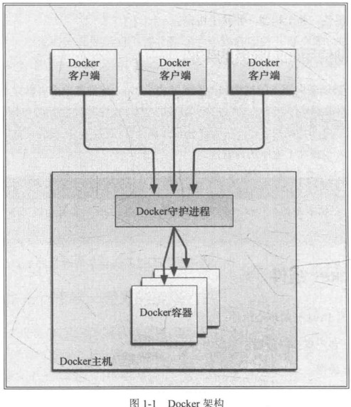

# 一 Docker简介

Docker极其简洁，它所需的全部环节只是一台仅仅安装了兼容版本的Linux内核和二进制文件最小限的宿主机。

Docker提供：

* 一个简单、轻量的建模方式
* 职责的逻辑分离
* 快速、高效的开发生命周期
* 鼓励使用面向服务的架构

Docker提供的组件：

* Docker客户端和服务器
* Docker镜像
* Registry
* Docker容器

Docker容器就是：

* 一个镜像格式
* 一系列标准的操作
* 一个执行环节

应用场景：

* 加速本地开发和构建流程
* 能够让独立服务或应用程序在不同的环境中，得到相同的运行结果

*　用Docker创建隔离的环境来进行测试
*　Docker可以让开发者先在本机上构建一个复杂的程序或架构来进行测试
*　构建一个多用户的平台服务基础设施
*　为开发、测试提供一个轻量级的沙盒环境
*　提供软件即服务应用程序
*　 高性能、超大规模的宿主机部署

Docker 可以是短生命周期的，但也可以用于恒定的环境，可以用一次销毁，也可以提供持久的服务。

Docker的技术组件：

* 一个原生的Linux容器格式
* Linux内核的命名空间
* 文件系统隔离
* 进程隔离
* 网络隔离
* 资源隔离和分组
* 写时复制
* 日志
* 交互式Shell