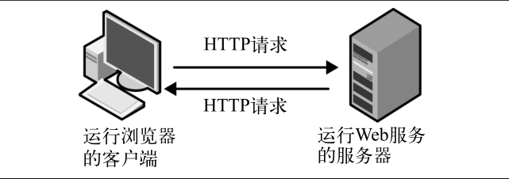
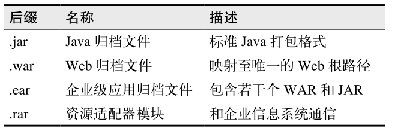
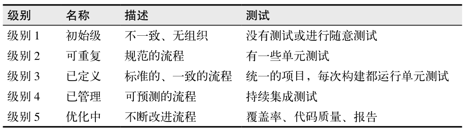

# 变化

软件开发方式变了。流行的“敏捷宣言”提倡：

* 个体和互动高于流程和工具； 
* 工作的软件高于详尽的文档； 
* 客户合作高于合同谈判；
* 响应变化高于遵循计划。 

对如何与现代 Web 应用交互，用户的需求是明确的：

* Web 应用需能跨平台访问；
* Web 应用需在不同平台上提供一致的用户体验；
* Web 应用需响应及时，没有延迟。

如果某公司网站的访问速度比直接竞争对手的慢 250 毫秒，那么访问量就会相对少很多。

“约定优于配置”是来自 Ruby on Rails 社区的箴言。

搭建原型有以下几个目的：

* 验证项目的技术基础；
* 为不同技术搭建桥梁，将它们纳入同一结构；
* 让最终用户和系统交互，明确系统用途和用户界面设计；
* 让系统设计师明确接口和系统之间传递信息的数据结构；
* 让程序员能在应用的各个部分并行工作。 

原型还有很多优点，如下。

* 原型是具体的、实实在在的，它们代表了待设计的最终系统。
* 原型是具体的实现。
* 原型能迅速暴露可能失败的地方。



为什么需要客服端-服务器端的Web应用：

1. 代码组织结构/软件架构
2. “设计灵活性与”与“使用开源API”
3. 原型
4. 开发者的效率
5. 应用性能

# 第二种

核心 JavaScript 语言需要结合两个不同的 API 来理解：浏览器对象模型（BOM）和文档和对象模型（DOM）


ECMAScript语言规范定义了三个执行上下文：全局、eval和函数。

JavaScript 中的字面函数由以下四部分组成：

* function操作符；
* 可省略的函数名；
* 一对小括号（包含零到多个参数）；
* 一对大括号（包含零到多条语句）。

可以在函数中定义其他函数，内部的函数可以访问外部函数的变量。一个函数返回一个内部函数时，就形成了闭包。返回的对象既包含了函数本身，也包含创建函数时的环境。

立即执行函数（immediate function）将代码限定在函数的局部作用域内，避免了污染全局作用域。

有四种方式调用函数：

* 函数；
* 方法；
* 构造函数；
* 使用 call()或apply() 。

不可见 JavaScript 是使客户端 UI 层实现松耦合的一组最佳实践：

* 使用 HTML 定义页面数据结构；
* 使用 CSS 为数据结构增加样式；
* 使用 JavaScript 为页面增加交互功能。

也可以这样说：

* 避免在 CSS 中使用 JavaScript；
* 避免在 JavaScript 中使用 CSS；
* 避免在 HTML 中使用 JavaScript；
* 避免在 JavaScript 中使用 HTML。 

# 第三章 REST和JSON

什么是REST（表述性的状态转移）：

* 资源
* 动词（HTTP请求）
* 

REST 架构规定：访问或修改 Web 上的资源，和访问或修改数据库中的记录一样，需要使用 SQL 或其他查询的语言。


URI 可进一步划分为统一资源名（URN，代表资源的名字）和统一资源定位符（URL，代表资源的地址）。

大多数 URL 遵循如下格式:

```
<scheme>://<user>:<password>@<host>:<port>/<path>;<parameters>?<querykey/value pairs>#<fragment identifier>
```

REST约束：

1. 客户端-服务器端
2. 无状态
3. 可缓存
4. 统一接口
5. 分层
6. 按需交付代码


从严格意义上来说，如果 JSON 或者JavaScript（这是前者的基础）没有链接数据类型，一个 Web API 就不能称为“RESTful”API。

**REST 是着眼于长久的软件设计：每个细节都提倡软件的持久性和独自进化。很多限制直接牺牲了短期效率。遗憾的是，人们擅长短期设计，在长期设计上却表现糟糕。大多数人认为在当前版本发布后，不会再去设计。有很多软件方法将长期设计刻画为错误的、象牙塔里的设计（没错，如果设计不是由真实需求驱动，会变成这样）。**


# 第七章

在如下交互之间提高生产效率：

* 人与人；
* 计算机与计算机；
* 人与计算机。


为了提高生产效率，需要：

* 重新定义任务；
* 提高（给定资源或资源之间交互的）效率；
* 增加资源；
* 花费更多精力（通过加班让单位资源的产出更高）。 

# 第八章


REST 并没有要求 Web API 在设计的时候考虑变更及修改，它的约束是为了推广更加轻松可变的系统

指引：

1. 名词即资源，动词即HTTP行为
2. 请求参数作为修饰符
3. Web API版本
4. HTTP标头
5. 链接
6. 响应
7. 文档
8. 格式约定
9. 安全性

# 第九章

在标准的用法中，JavaScript 在内容体的 onload 事件执行后，即页面加载后运行。 load 事件会在页面全部呈现完成后触发（包括全部资源，如图片）。jQuery 提供了一个可以更早运行的事件，就是在 DOM 就绪之后。

# 第十一章

Java 归档（JAR）文件用来将 Java 类和资源文件打包成单个归档文件。JAR 文件使用 ZIP格式压缩，并包含一个路径名为 META-INF/MANIFEST.MF 的 Manifest 资源配置文件。



非Java应用的部署：

1. 服务器在应用之外
2. 服务器和应用并行
3. 服务器在应用里面

不同部署方式带来的影响：

1. 负载均衡
2. 自动化应用部署

# 第十二章




测试只能证明有问题，不能证明没问题。

