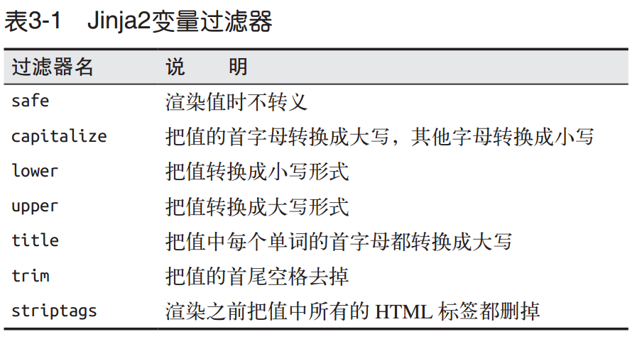
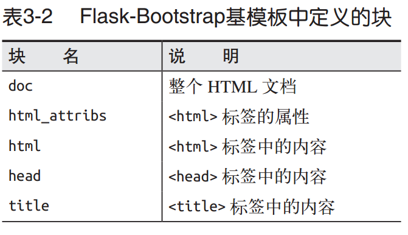
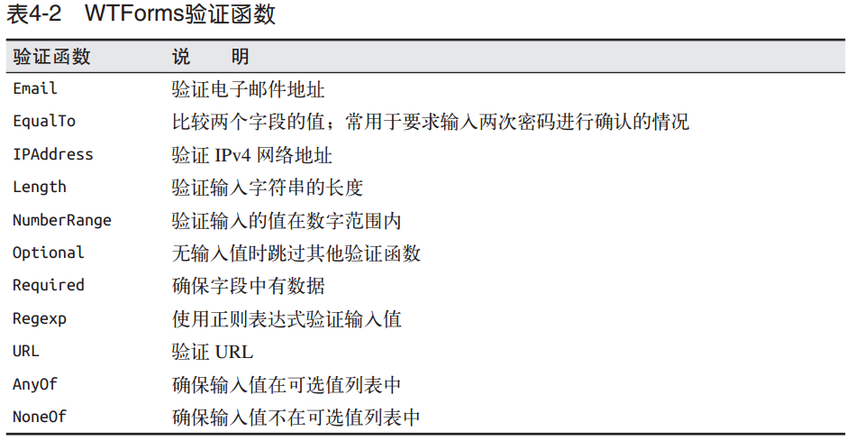
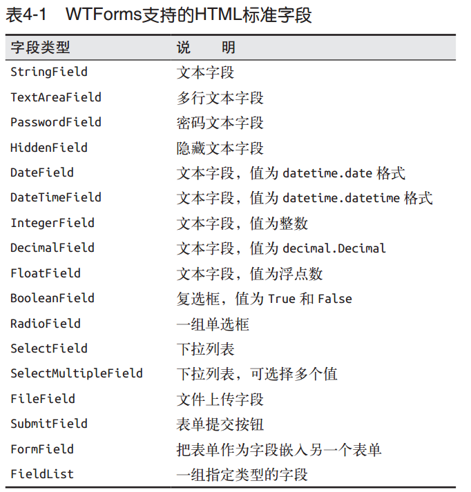

# 第一章 安装

Flask 有两个主要依赖：路由、调试和 Web 服务器网关接口（Web Server Gateway Interface，WSGI）子系统由 Werkzeug提供；模板系统由 Jinja2提供 。

# 第二章 程序的基本结构

客户端（例如 Web 浏览器）把请求发送给 Web 服务器，Web 服务器再把请求发送给 Flask程序实例。程序实例需要知道对每个 URL 请求运行哪些代码，所以保存了一个 URL 到Python 函数的映射关系。处理 URL 和函数之间关系的程序称为路由。

修饰器是 Python 语言的标准特性，可以使用不同的方式修改函数的行为。惯常用法是使用修饰器把函数注册为事件的处理程序。

视图函数返回的响应可以是包含HTML 的简单字符串，也可以是复杂的表单。

## 程序请求上下文

为了避免大量可有可无的参数把视图函数弄得一团糟，Flask 使用上下文临时把某些对象变为全局可访问。

在 Flask 中有两种上下文：程序上下文和请求上下文

## 请求调度

程序收到客户端发来的请求时，要找到处理该请求的视图函数。为了完成这个任务， Flask会在程序的 URL 映射中查找请求的 URL。 URL 映射是 URL 和视图函数之间的对应关系。 

URL 映射中的 HEAD 、 Options 、 GET 是请求方法，由路由进行处理。Flask 为每个路由都指定了请求方法，这样不同的请求方法发送到相同的 URL 上时，会使用不同的视图函数进行处理。 HEAD 和 OPTIONS 方法由 Flask 自动处理

## 请求钩子

请求钩子使用修饰器实现。Flask 支持以下 4 种钩子：

* before_first_request：注册一个函数，在处理第一个请求之前运行。

* before_request：注册一个函数，在每次请求之前运行。
* after_request：注册一个函数，如果没有未处理的异常抛出，在每次请求之后运行。
* teardown_request：注册一个函数，即使有未处理的异常抛出，也在每次请求之后运行。

## 响应

重定向经常使用 302 状态码表示，指向的地址由 Location 首部提供。重定向响应可以使用3 个值形式的返回值生成，也可在 Response 对象中设定。不过，由于使用频繁，Flask 提供了 redirect() 辅助函数，用于生成这种响应

abort 不会把控制权交还给调用它的函数，而是抛出异常把控制权交给 Web 服务器。 

专为 Flask 开发的扩展都暴漏在` flask.ext` 命名空间下。

# 第三者 模板

Flask 使用了一个名为 Jinja2 的强大模板引擎。

## Jinja2 

默认情况下，Flask 在程序文件夹中的 templates 子文件夹中寻找模板。

 在模板中使用的` {{ name }}` 结构表示一个变量，它是一种特殊的占位符，告诉模板引擎这个位置的值从渲染模板时使用的数据中获取。

千万别在不可信的值上使用 safe 过滤器。

Jinja2 提供了多种控制结构 ，并且还支持宏处理。为了重复使用宏，我们可以将其保存在单独的文件中，然后在需要使用的模板中导入。另一种重复使用代码的强大方式是模板继承，它类似于 Python 代码中的类继承。 

block 标签定义的元素可在衍生模板中修改。 

## 使用Bootstrap

要想在程序中集成 Bootstrap，显然要对模板做所有必要的改动。不过，更简单的方法是使用一个名为 Flask-Bootstrap 的 Flask 扩展，简化集成的过程。

初始化 Flask-Bootstrap 之后，就可以在程序中使用一个包含所有 Bootstrap 文件的基模板。这个模板利用 Jinja2 的模板继承机制，让程序扩展一个具有基本页面结构的基模板，其中就有用来引入 Bootstrap 的元素。

基模板中定义了可在衍生模板中重定义的块。 `block `和` endblock` 指令定义的块中的内容可添加到基模板中。 

Bootstrap 所需的文件在 styles 和 scripts 块中声明。如果程序需要向已经有内容的块中添加新内容， 必须使用 Jinja2 提供的 `super() `函数。 

## 链接

在模板中直接编写简单路由的 URL 链接不难，但对于包含可变部分的动态路由，在模板中构建正确的 URL 就很困难。而且，直接编写 URL 会对代码中定义的路由产生不必要的依赖关系。如果重新定义路由，模板中的链接可能会失效。为了避免这些问题，Flask 提供了` url_for() `辅助函数，它可以使用程序 URL 映射中保存的信息生成 URL。

`url_for()` 函数最简单的用法是以视图函数名（或者`app.add_url_route() `定义路由时使用的端点名）作为参数， 返回对应的 URL。 

生成连接程序内不同路由的链接时，使用相对地址就足够了。如果要生成在浏览器之外使用的链接，则必须使用绝对地址。

## 静态文件

静态文件的引用被当成一个特殊的路由，即`/static/<filename>`。默认设置下，Flask 在程序根目录中名为 static 的子目录中寻找静态文件。如果需要，可在static 文件夹中使用子文件夹存放文件

## 时间和日期

要想在服务器上只使用 UTC 时间，一个优雅的解决方案是，把时间单位发送给 Web 浏览器，转换成当地时间，然后渲染。Web 浏览器可以更好地完成这一任务，因为它能获取用户电脑中的时区和区域设置。

Flask-Monet 假定服务器端程序处理的时间戳是“纯正的” datetime 对象，且使用 UTC 表示。

Flask-Moment 渲染的时间戳可实现多种语言的本地化。语言可在模板中选择，把语言代码传给 lang() 函数即可。

# 第四章 web表单

## 跨站请求伪造保护

默认情况下，Flask-WTF 能保护所有表单免受跨站请求伪造（Cross-Site Request Forgery，CSRF）的攻击。恶意网站把请求发送到被攻击者已登录的其他网站时就会引发 CSRF 攻击。

为了增强安全性，密钥不应该直接写入代码，而要保存在环境变量中。

## 表单

使用 Flask-WTF 时，每个 Web 表单都由一个继承自 Form 的类表示。这个类定义表单中的一组字段，每个字段都用对象表示。字段对象可附属一个或多个验证函数。验证函数用来验证用户提交的输入值是否符合要求 。

Jinja2 中的条件语句格式为 `......`。如果条件的计算结果为 True，那么渲染 if 和 else 指令之间的值。如果条件的计算结果为False，则渲染 else 和 endif 指令之间的值。 

也可作为 GET 请求提交，不过 GET 请求没有主体，提交的数据以查询字符串的形式附加到URL 中，可在浏览器的地址栏中看到。基于这个以及其他多个原因，提交表单大都作为POST 请求进行处理。

## 重定向和用户会话 

默认情况下，用户会话保存在客户端 cookie 中，使用设置的 `SECRET_KEY `进行加密签名。 如果篡改了 cookie 中的内容，签名就会失效，会话也会随之失效。 

`url_for() `函数的第一个且唯一必须指定的参数是端点名，即路由的内部名字。 默认情况下，路由的端点是相应视图函数的名字。 

# 第五章 数据库

选择数据库时候应该考虑的因素：

* 易用性
* 性能
* 可移植性

更新表的更好方法是使用数据库迁移框架。源码版本控制工具可以跟踪源码文件的变化，类似地，数据库迁移框架能跟踪数据库模式的变化，然后增量式的把变化应用到数据库中。

# 第七章 大型程序的结构

在单个文件中开发程序很方便，但却有个很大的缺点，因为程序在全局作用域中创建，所以无法动态修改配置。运行脚本时，程序实例已经创建，再修改配置为时已晚。这一点对单元测试尤其重要，因为有时为了提高测试覆盖度，必须在不同的配置环境中运行程序。这个问题的解决方法是延迟创建程序实例，把创建过程移到可显式调用的工厂函数中。

在蓝本中定义的路由处于休眠状态，直到蓝本注册到程序上后，路由才真正成为程序的一部分。

# 第八章 用户认证

若想保证数据库中用户密码的安全，关键在于不能存储密码本身，而要存储密码的散列值。计算密码散列值的函数接收密码作为输入，使用一种或多种加密算法转换密码，最终得到一个和原始密码没有关系的字符序列。核对密码时，密码散列值可代替原始密码，因为计算散列值的函数是可复现的：只要输入一样，结果就一样。

我们也可将蓝本配置成使用其独立的文件夹保存模板。如果配置了多个模板文件夹， render_template() 函数会首先搜索程序配置的模板文件夹，然后再搜索蓝本配置的模板文件夹。

注册蓝本时使用的 url_prefix 是可选参数。如果使用了这个参数，注册后蓝本中定义的所有路由都会加上指定的前缀。

LoginManager 对象的 session_protection 属性可以设为 None 、 'basic' 或 'strong' ，以提供不同的安全等级防止用户会话遭篡改。设为 'strong' 时，Flask-Login 会记录客户端 IP地址和浏览器的用户代理信息，如果发现异动就登出用户。 login_view 属性设置登录页面的端点。

在生产服务器上，登录路由必须使用安全的 HTTP，从而加密传送给服务器的表单数据。如果没使用安全的HTTP，登录密令在传输过程中可能会被截取，在服务器上花再多的精力用于保证密码安全都无济于事。

# 第九章 用户角色

有多种方法可用于在程序中实现角色。具体采用何种实现方法取决于所需角色的数量和细分程度。例如，简单的程序可能只需要两个角色，一个表示普通用户，一个表示管理员。复杂的程序可能需要在普通用户和管理员之间再细分出多个不同等级的角色。有些程序甚至不能使用分立的角色，这时赋予用户某些权限的组合或许更合适。

# 第十章 用户资料

