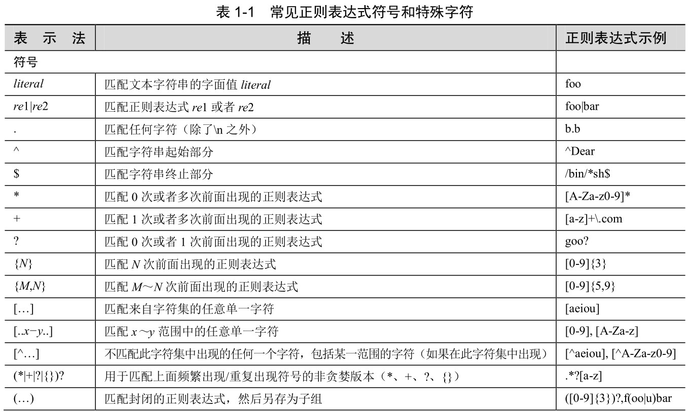
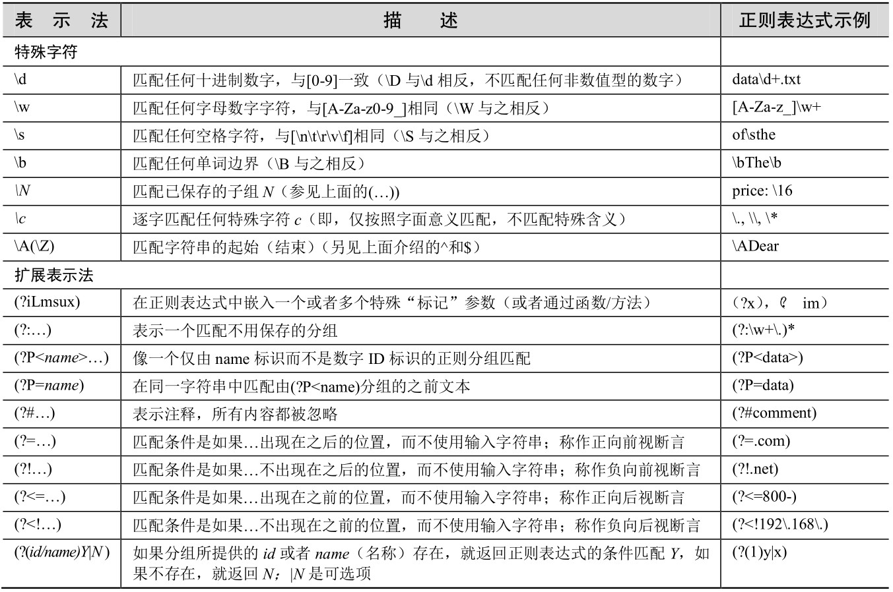
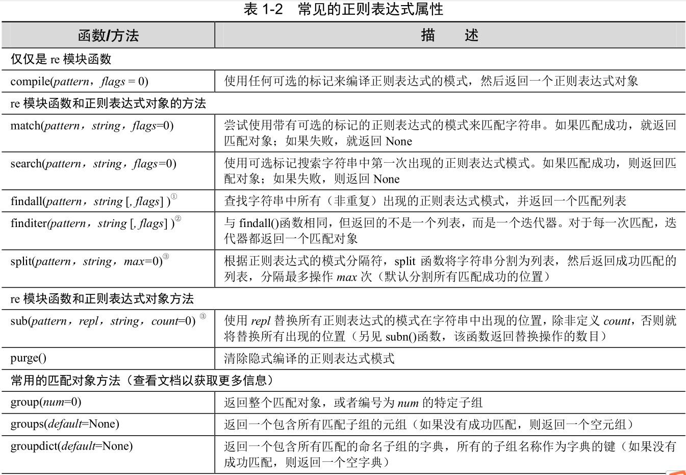

# 第一章 正则表达式

正则表达式为高级的文本模式匹配、抽取、与/或文本形式的搜索和替换功能提供了基础。

Python通过标准库中的re模块来支持正则表达式。

术语“匹配”（matching），指的是术语“模式匹配”（pattern-matching）。在Python 术语中，主要有两种方法完成模式匹配：“搜索”（searching），即在字符串任意部分中搜索匹配的模式；而“匹配”（matching）是指判断一个字符串能否从起始处全部或者部分地匹配某个模式。搜索通过` search()`函数或方法来实现，而匹配通过调用` match()`函数或方法实现。

当模式匹配使用分组操作符时，正则表达式引擎将试图“吸收”匹配该模式的尽可能多的字符。

当使用正则表达式时，一对圆括号可以实现以下任意一个（或者两个）功能：

* 对正则表达式进行分组；
*  匹配子组。

使用预编译的代码对象比直接使用字符串要快，因为解释器在执行字符串形式的代码前都必须把字符串编译成代码对象。同样的概念也适用于正则表达式 — 在模式匹配发生之前，正则表达式模式必须编译成正则表达式对象。

`match()`函数试图从字符串的起始部分对模式进行匹配。如果匹配成功，就返回一个匹配对象；如果匹配失败，就返回 None，匹配对象的 `group()`方法能够用于显示那个成功的匹配。

