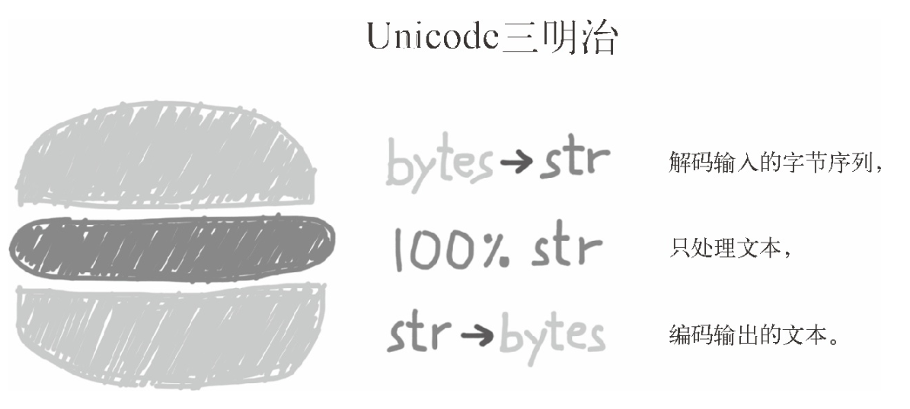

# 第一章 Python数据模型

自Python 2.6 开始，`namedtuple`就加入到 Python 里，用以构建只有少数属性但是没有方法的对象，比如数据库条目。

通过实现特殊的方法来利用Python数据模型的好处：

* 不必去记住标准操作的名称
* 可以更加方便的利用标准库

迭代通常是隐式的，譬如说一个集合类型没有实现` __contains__ `方法，那么` in` 运算符就会按顺序做一次迭代搜索。

通常你的代码无需直接使用特殊方法。除非有大量的元编程存在，直接调用特殊方法的频率应该远远低于你去实现它们的次数。

`__repr__` 所返回的字符串应该准确、无歧义，并且尽可能表达出如何用代码创建出这个被打印的对象。

如果你只想实现这两个特殊方法中的一个，`__repr__` 是更好的选择，因为如果一个对象
没有` __str__` 函数，而 Python 又需要调用它的时候，解释器会用 `__repr__` 作为替代。

Python 对象的一个基本要求就是它得有合理的字符串表示形式

# 第二章 序列构成的数组

容器序列存放的是它们所包含的任意类型的对象的引用，而扁平序列里存放的是值而不是引用。

生成器表达式背后遵守了迭代器协议，可以逐个地产出元素，而不是先建立一个完整的列表，然后再把这个列表传递到某个构造函数里。

元组其实是对数据的记录：元组中的每个元素都存放了记录中一个字段的数据，外加这个字段的位置。

元组拆包可以应用到任何可迭代对象上，唯一的硬性要求是，被可迭代对象中的元素数量必须要跟接受这些元素的元组的空档数一致。

对于元祖的三个教训：

* 不要把可变对象放在元组里面。
* 增量赋值不是一个原子操作。我们刚才也看到了，它虽然抛出了异常，但还是完成了操作。
* 查看 Python 的字节码并不难，而且它对我们了解代码背后的运行机制很有帮助。

`list.sort` 方法会就地排序列表，也就是说不会把原列表复制一份。

如果一个函数或者方法对对象进行的是就地改动，那它就应该返回` None`，好让调用者知道传入的参数发生了变动，而且并未产生新的对象。

# 第三章 字典和集合

标准库里的所有映射类型都是利用` dict `来实现的，因此它们有个共同的限制，即只有可散列的数据类型才能用作这些映射里的键（只有键有这个要求，值并不需要是可散列的数据类型）

一般来讲用户自定义的类型的对象都是可散列的，散列值就是它们的 `id() `函数的返回值，所以所有这些对象在比较的时候都是不相等的。如果一个对象实现了 `__eq__`方法，并且在方法中用到了这个对象的内部状态的话，那么只有当所有这些内部状态都是不可变的情况下，这个对象才是可散列的。

如果要自定义一个映射类型，更合适的策略其实是继承`collections.UserDict` 类。

`UserDict` 并不是 `dict` 的子类。

集合的本质是许多唯一对象的聚集。

一个可散列的对象必须满足以下要求：

1. 支持` hash()` 函数，并且通过` __hash__() `方法所得到的散列值是不变的;
2. 支持通过` __eq__()` 方法来检测相等性。
3. 若` a == b` 为真，则 `hash(a) == hash(b) `也为真。

`dict`的实现及其导致的结果：

1. 键必须是可散列的
2. 字典在内存上的开销巨大
3. 键查询很快
4. 键的次序取决于添加顺序
5. 往字典里添加新键可能会改变已有的键的顺序

`set`的实现以及导致的结果:

1. 集合里的元素必须是可散列的。
2. 集合很消耗内存。
3. 可以很高效地判断元素是否存在于某个集合。
4. 元素的次序取决于被添加到集合里的次序。
5. 往集合里添加元素，可能会改变集合里已有元素的次序。

# 第四章 文本和字节序列

“字符串”是个相当简单的概念：一个字符串是一个字符序列。

Unicode 标准把字符的标识和具体的字节表述进行了如下的明确区分：

* 字符的标识，即码位
* 字符的具体表述取决于所用的编码

把字节序列变成人类可读的文本字符串就是解码，而把字符串变成用于存储或传输的字节序列就是编码。

使用缓冲类对象创建 bytes 或 bytearray 对象时，始终复制源对象中的字节序列。

Python 比较任何类型的序列时，会一一比较序列里的各个元素。

在 Python 中，非 ASCII 文本的标准排序方式是使用 `locale.strxfrm` 函数。

# 第五章 一等函数

编程语言理论家把“一等对象”定义为满足下述条件的程序实体：

* 在运行时创建
* 能赋值给变量或数据结构中的元素
* 能作为参数传给函数
* 能作为函数的返回结果

Python 简单的句法限制了 lambda 函数的定义体只能使用纯表达式。换句话说，lambda 函数的定义体中不能赋值，也不能使用 while 和 try 等 Python 语句。

lambda表达式重构秘籍：

如果使用 lambda 表达式导致一段代码难以理解，Fredrik Lundh 建议像下面这样重构：

1.  编写注释，说明 lambda 表达式的作用。
2. 研究一会儿注释，并找出一个名称来概括注释。
3. 把 lambda 表达式转换成 def 语句，使用那个名称来定义函数。
4. 删除注释。

Python 数据模型文档列出了 7 种可调用对象：

1. 用户定义的函数
2. 内置函数
3. 内置方法
4. 方法
5. 类
6. 类的实例
7. 生成器函数

Python 中有各种各样可调用的类型，因此判断对象能否调用，最安全的法是使用内置的 `callable() `函数。

装饰器必须是函数，而且有时要在多次调用之间“记住”某些事。

