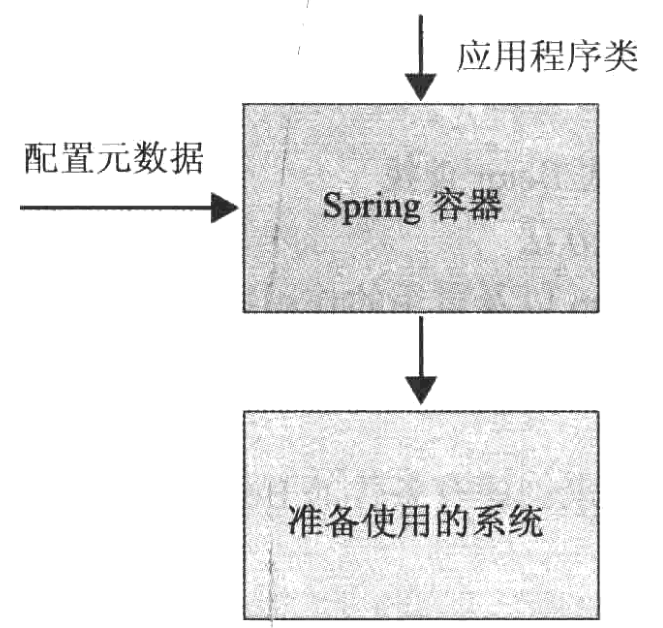
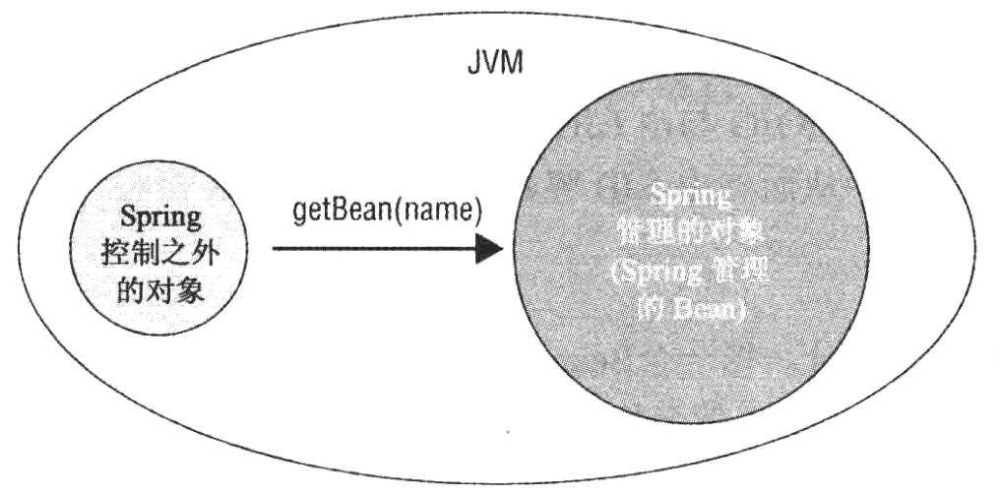

# spring入门经典

## 第一章POJO编程模式、轻量级容器和控制反转

容器：在该环境中，所有组件都被创建和装配，并且提供了所需服务的中间件服务

控制反转：在组件类中，不需要使用新的操作符来实例化依赖组件，而是在运行时由容器实例将依赖组件注入组件。因此，对依赖项的控制由组件转到容器。

控制反转的两种形式：依赖查找和依赖注入

中间件服务：在每一个应用程序中都会出现的需求，这些需求独立于业务需求

## 第二章 使用Spring进行依赖注入

Spring Application Framework的核心是IoC容器。

所有的Bean都被定义在`<beans>`元素中，而每一个Bean则使用`<bean>`元素进行定义。Bean的名称由id特性定义。应用程序或者配置元数据中的其他Bean定义可以通过名称访问相关的Bean。

`@Autowired`通常用来指定在运行时被Spring容器所注入的Bean依赖。

Spring容器也是一个Java对象，在某些特定的时间点被创建，并允许管理应用程序的其他部分。在独立的应用程序中，可以使用编程方法，而在Web应用程序中，使用声明方法则是更好的选择。

在工厂方法中，首先通过调用Setter方法设置所需的依赖项，然后使用具体类创建一个Bean并将其返回。此外，依赖项还可以通过构造函数参数的形式赋予。

工厂方法的返回类型被定义为接口而不是具体类。

默认情况下，没一个Bean都有一个被称为单实例作用域的单个实例。Spring在运行时动态地扩展`@Congfiguraton`类中多次调用工厂方法，在第一次创建了Bean实例之后就不会创建任何新的Bean实例。对于连续调用，工厂方法将会返回相同的Bean实例。

`@Service`除了将一个类定义为一个Bean之外，再无其他特殊含义。而注解`@Repository`能够启用与Spring数据访问相关的其他功能。

默认情况下，Bean的名称派生自简单的类名但首字母小写。

Spring通过扫描类路劲中存在的类，尝试在启动期间识别带有注解`@Component`的类及其派生类。

需要将`<context:component-scan/>`放到Bean配置文件中。为此，需要通过在元素`<beans>`的上面添加架构位置指令来启用上下文命名空间功能。

每一个Spring模块都有自己的命名空间支持，并针对不同的目的提供了多个命名空间元素。

## 依赖注入

### Setter注入

Spring需要尽可能多地处理必要的类型转换。Spring通过使用内置的属性编辑器来完成转换工作，此外，还可以添加自定义编辑器，以便处理默认情况下Spring不能处理其他类型转换。

### 构造函数注入

Spring容器首先查看Bean定义中的`<constructor-arg/>`元素，并识别`<constructor-arg/>`元素指定的依赖项，然后使用Java反射尝试找到一个合适的构造函数。`<contructor-arg/>`元素的顺序并不重要。在确定了合适的构造函数之后，Spring容器将依赖项作为输入参数值并传入调用构造函数。有时需要提供一个index特性。

**构造函数注入的其中一个缺点是无法处理循环依赖**

Spring容器的启动过程大致可分为两个主要阶段：

1. 容器处理配置元数据并建立元数据中存在的Bean定义，在该过程中还会对这些Bean定义进行验证
2. 完成Bean的创建，然后完成依赖注入

一个Bean在被完全 创建且自己的依赖项被注入之前是不会作为一个依赖项被注入到其他Bean中去。

Spring容器提供了两种不同形式的Bean重写机制：

1. 发生在Bean配置元数据文件级别
2. 发生在容器级别

可以在基于XML的配置中通过使用`<bean>`元素的depends-on特性来指定Bean b在Bean a之前被创建。只有在无状态Bean的情况下，当该Bean使用了depends-on特性时，depends-on特性中所列举的Bean才被销毁。（注解形式为`@DependsOn`）。当在类级别使用`@DependOn`注解是，通常在组件扫描期间进行处理，此时只有在`@DependOn`注解内指定的Bean被创建之后才会创建本类，否则就不会创建本类。

自动装配中有三种模式：ByType、ByName和constructor。如果有多个Bean实例合适自动转配DAO某一个特定属性，那么依赖注入将会失败。一种方法是从自动转配的候选Bean中进行过滤，并注入剩下的Bean，可以使用`autowire-candidate`

Spring提供了`Qualifier`注解，当将`@Qualifer`注解与`@Autowired`和`@Bean`注解放置在一起时，自动装配模式将变为byName

`@Qualifier`注解接受了一个String值，通过该值乐易更改秒人的限定值。这样一来，可以根据不同的限定，可以自动转配那些名称与属性名称并不匹配的其他Bean。

自动装配仅适用于对其他Bean的依赖，而不适用于纯粹值，对于这些值，可以在字段或Setter方法上使用`@Value`注解。`@Value`注解接受一个String值，该值指定了将要被注入DAO内置的Java类型属性的值，而必要的类型转换则由Spring容器处理。其还可以用于表达式驱动的依赖注入。

在Spring容器控制之外的对象获取在Spring容器中的Bean

不管如何努力，某些情况下总会需要从处于Spring容器控制之外的其他对象访问Bean，在这种情况下，这些对象首先应该获取该对该环境中ApplicationContext实例的引用，对于独立的应用程序，应该由开发人员显示处理该任务。对于web应用程序，Spring提供了一个WebApplicationContextUtils的实用工具类，该类中的方法可以返回Web应用程序的ApplicationContext实例。

## Spring管理Bean

在基于XML的配置文件中，使用id特性将一个名称分配个一个Bean，相同的XML文件中不能复制同一个名称，在其他文件中XML文件可以将相同的名称分配给另一个Bean定义，这种情况下，Bean重写机制开始发挥作用。

基于注解的配置`@Component`及其派生接收一个Strting值作为Bean名称，如果没有提供名称，那么默认情况下一个简单的类名（第一个字符小写）将成为Bean名称。

创建Bean的方法：

1.  调用相关类中一个可用的构造函数
2. 调用可用的静态或实例工厂方法
3. 使用Spring自带的FactoryBean接口

默认情况下，由Spring容器创建的所有Bean都是Singleton作用域。当不同的Bean与不同的层相对应的时，可用使用Singleton作用域，此时创建的实例都是无状态实例，在同一时间服务于不同的请求。

Spring的作用域：

1. Singleton
2. protype
3. Request
4. Session
5. globalSession

当定义Request作用域Bean和Session作用域Bean时，必须在`<Bean>`元素中放置`<aop:scoped-proxy/`元素作为一个子元素。

`@Scope`注解被用来在类级别或工厂级别指定当前Bean定义的作用域，其通过一个String值标示Bean定义的作用域，此外还可以接受第二个参数，该参数可以修改代理生成模式。

一些Bean可能只在特定的场合或备选方案中使用，在其他情况下并不需要。在这种情况下，预先初始化可能会导致不必要的堆内存消耗

如果在带有`@Component`注解的类级别或者在带有`@Bean`注解的工厂方法级别将`@Lazy`特性设置为true，那么Bean定义就是延迟初始化

生命周期回调：

1. 基于XML的配置的``元素有init-method和destory-method特性，它们接收Bean类中的方法名称作为特性值
2. Spring还支持JSR-250 Common Java注解`@PostConstruct`和`PreDestory`注解
3. 使用Spring提供的两个特殊接口：InitializingBean和DisposableBean,，分别声明了afterPropertiesSet()和destory()方法