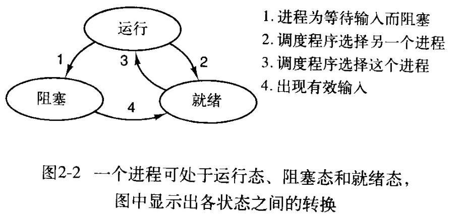

# 第一章 引论

用户与之交互的程序，基于文本的通常称为shell，而基于图标的则称为图形用户界面，它们实际上不是操作系统的一部分，尽管这些程序使用操作系统来完成工作。

多数计算机有两种运行模式：内核态和用户态

好的抽象可以把一个几乎不可能管理的任务划分为两个可管理的部分，其中第一部分是有关抽象的定义和实现，第二部分是随时用这些抽象解决问题。

操作新系统的一个主要任务是隐藏硬件，呈现给程序良好、清晰、优雅、一致的抽象。

操作系统的实际客户是应用程序。

操作徐彤的任务是在相互禁止的程序之间有序的控制对处理器、存储器以及其他I/O接口设备的分配。

操作系统的主要任务是记录哪个程序在使用什么资源，对资源请求进行分配、评估使用代价，并且为不同的程序和用户调解互相冲突的资源请求。

资源包管理器包括以下两种不同方式实现多路复用资源：在时间上复用和在空间上复用。

无敌了从操作系统中获得服务，用户必须使用系统调用进入内核并调用操作系统。

在理想情形下，存储器应该极为迅速、充分大，并且非常便宜。

I/O设备一般包括两个部分：设备控制器和设备本身。

要将设备驱动程序装入操作系统的三个途径：

1. 将内核与设备驱动程序重新链接，然后重启系统
2. 在一个操作系统文件中设置一个入口，并通知该文件需要一个设备驱动程序，然后重启系统
3. 操作系统能够在运行时接受新的设备驱动程序并且立即将其安装好，无需重新启动

实现输入和输出的三种方式：

1. 用户承德县发出一个系统调用，内核将其翻译成一个对应设备驱动程序的过程调用
2. 设备驱动程序启动设备并且让该涉笔在操作系统完成是发出一个中断
3. 为I/O使用一种特使的直接存储器访问芯片

任何单CPU计算机一次只能执行一条指令。若果一个进程正在用户态中运行一个程序，并且需要一个系统服务，那么他就必须执行一个陷阱或系统调用指令，将控制转移到操作系统。

在Unix中的进程将其存储空间分为三段：正文段、数据段以及堆栈段。

数据向上增长而堆栈向下增长。

指针是一种指向一个变量或数据结构的变量

# 第二种 进程与线程

进程是在对正在运行程序的一个抽象。

## 进程

在进程模型中，计算机所有可运行的软件，通常也包括操作系统，被组织为若干顺序进程，简称进程。一个进程就是一个正在执行程序的实例。从概念上说，每个进程拥有他自己的虚拟CPU。

一个进程是某种类型的一个活动，它有程序、输入、输出以及状态。

从技术上看，新进程都是由于一个已存在的进程执行了一个用于创建进程的系统调用而创建的。

创建进程的方法：

1. 系统初始化
2. 执行了正在运行的进程所调用的进程创建系统调用
3. 用户请求了一个新进程
4. 一个批处理作业的初始化

在Unix系统中，只有一个系统调用可以用来创建新进程：fork。

进程终止的方法：

1. 正常的退出
2. 错误的退出
3. 验证错误
4. 被其他进程杀死

进程的三个状态：

1. 运行态
2. 就绪态
3. 阻塞态

操作系统的最底层是调度程序，在它上面有许多进程。