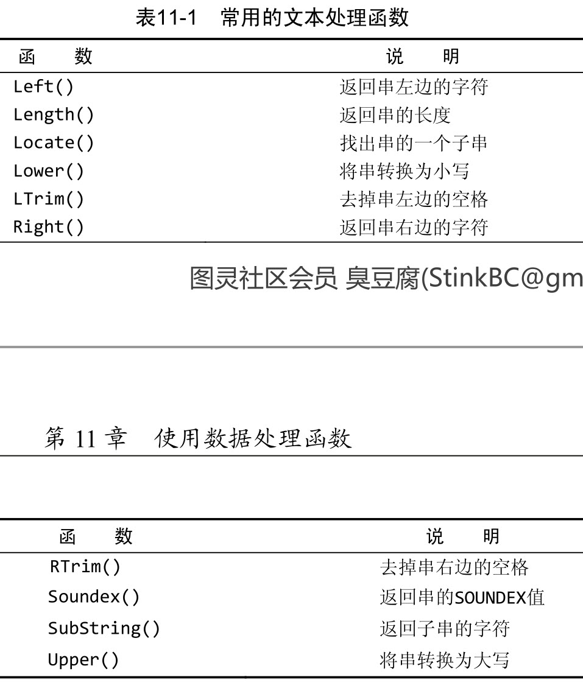
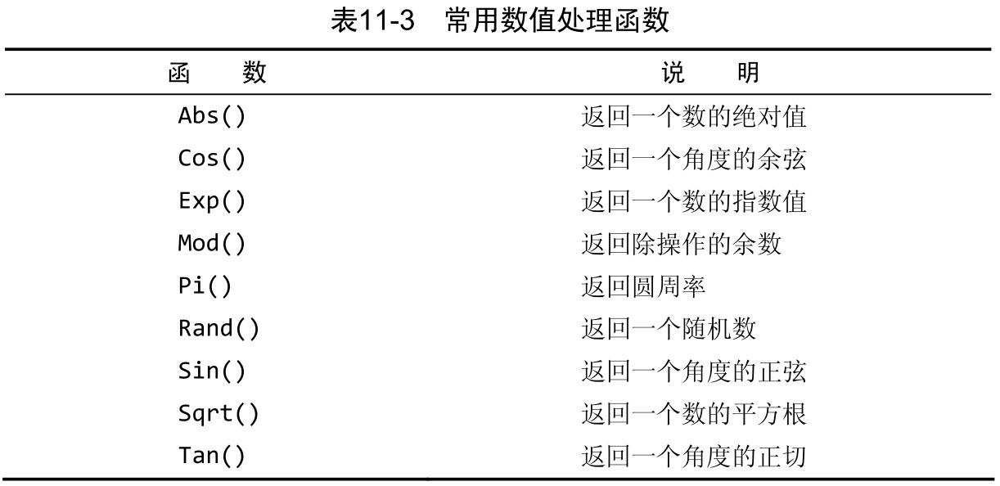
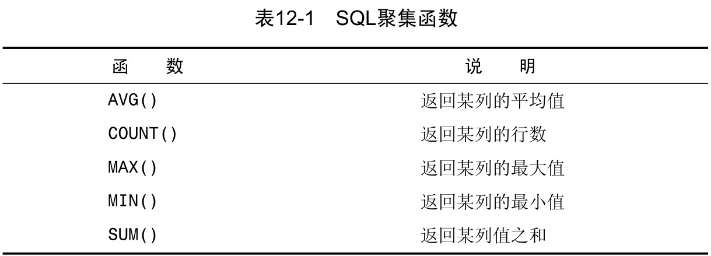
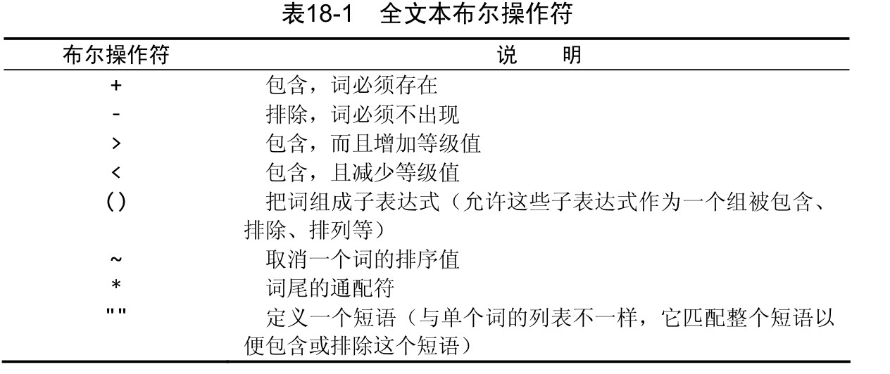

# 一 了解SQL

数据库（database） 保存有组织的数据的容器（通常是一个文件或一组文件）。

表（table） 某种特定类型数据的结构化清单。

模式（schema） 关于数据库和表的布局及特性的信息。

列（column） 表中的一个字段。所有表都是由一个或多个列组成的。

数据类型（datatype） 所容许的数据的类型。每个表列都有相应的数据类型，它限制（或容许）该列中存储的数据。

行（row） 表中的一个记录。

主键（primary key ） 一列（或一组列），其值能够唯一区分表中每个行。

表中的任何列都可以作为主键，只要它满足以下条件：

* 任意两行都不具有相同的主键值；
* 每个行都必须具有一个主键值（主键列不允许NULL值）。

除MySQL强制实施的规则外，应该坚持的几个普遍认可的最好习惯为：

* 不更新主键列中的值；
* 不重用主键列的值；
* 不在主键列中使用可能会更改的值。

# 二 MySQL简介

DBMS可分为两类：一类为基于共享文件系统的DBMS，另一类为基于客户机 — 服务器的DBMS

# 三 使用MySQL

为了连接到MySQL，需要以下信息：

* 主机名（计算机名）——如果连接到本地MySQL服务器，为 localhost；
* 端口（如果使用默认端口3306之外的端口）；
* 一个合法的用户名；
* 用户口令（如果需要）。

在你能执行任意数据库操作前，需要选择一个数据库。为此，可使用 USE 关键字

数据库、表、列、用户、权限等的信息被存储在数据库和表中。内部的表一般不直接访问。可用
MySQL的 SHOW 命令来显示这些信息（MySQL从内部表中提取这些信息）。

MySQL支持用 DESCRIBE 作为 SHOW COLUMNS FROM 的一种快捷方式。

SHOW STATUS ，用于显示广泛的服务器状态信息；

SHOW CREATE DATABASE和SHOW CREATE TABLE ，分别用来显示创建特定数据库或表的MySQL语句；
SHOW GRANTS ，用来显示授予用户（所有用户或特定用户）的安全权限；
SHOW ERRORS 和 SHOW WARNINGS ，用来显示服务器错误或警告消息。

# 四 检索数据

SQL语句不区分大小写，许多SQL开发人员喜欢对所有SQL关键字使用大写，而对所有列和表名使用小写，这样做使代码更易于阅读和调试。

SQL语句一般返回原始的、无格式的数据。数据的格式化是一个表示问题，而不是一个检索问题。

一般，除非你确实需要表中的每个列，否则最好别使用 * 通配符。虽然使用通配符可能会使你自己省事，不用明确列出所需列，但检索不需要的列通常会降低检索和应用程序的性能。

使用 DISTINCT 关键字指示MySQL只返回不同的值。DISTINCT 关键字应用于所有列而不仅是前置它的列。

SELECT 语句返回所有匹配的行，它们可能是指定表中的每个行。为了返回第一行或前几行，可使用 LIMIT 子句。

# 五 排序检索数据

关系数据库设计理论认为，如果不明确规定排序顺序，则不应该假定检索出的数据的顺序有意义。

一个子句通常由一个关键字和所提供的数据组成。

 ORDER BY 子句中使用的列将是为显示所选择的列。

为了按多个列排序，只要指定列名，列名之间用逗号分开即可（就像选择多个列时所做的那样）。

DESC 关键字只应用到直接位于其前面的列名。

# 六 过滤数据

在 SELECT 语句中，数据根据 WHERE 子句中指定的搜索条件进行过滤。WHERE 子句在表名（ FROM 子句）之后给出。


在创建表时，表设计人员可以指定其中的列是否可以不包含值。在一个列不包含值时，称其为包含空值 NULL 。

# 七 数据过滤

为了通过不止一个列进行过滤，可使用 AND 操作符给 WHERE 子句附加条件。

OR 操作符与 AND 操作符不同，它指示MySQL检索匹配任一条件的行。

由于 AND 在计算次序中优先级更高，操作符被错误地组合了。

 IN 操作符用来指定条件范围，范围中的每个条件都可以进行匹配。 IN 取合法值的由逗号分隔的清单，全都括在圆括号中。

为什么要使用 IN 操作符？其优点具体如下：

* 在使用长的合法选项清单时， IN 操作符的语法更清楚且更直观。
* 在使用 IN 时，计算的次序更容易管理（因为使用的操作符更少）。
* IN 操作符一般比 OR 操作符清单执行更快。
* IN 的最大优点是可以包含其他 SELECT 语句，使得能够更动态地建立 WHERE 子句。

WHERE 子句中的 NOT 操作符有且只有一个功能，那就是否定它之后所跟的任何条件。

# 八 用通配符进行过滤

通配符（wildcard） 用来匹配值的一部分的特殊字符

搜索模式（search pattern）由字面值、通配符或两者组合构成的搜索条件。

最常使用的通配符是百分号（ % ）。在搜索串中， % 表示任何字符出现任意次数。

根据MySQL的配置方式，搜索可以是区分大小写的。

尾空格可能会干扰通配符匹配。

虽然似乎 % 通配符可以匹配任何东西，但有一个例外，即 NULL。

另一个有用的通配符是下划线（ _ ）。下划线的用途与 % 一样，但下划线只匹配单个字符而不是多个字符。

使用通配符的技巧：

* 不要过度使用通配符。
* 在确实需要使用通配符时，除非绝对有必要，否则不要把它们用在搜索模式的开始处。
* 仔细注意通配符的位置。

# 九 用正则表达式进行搜索

REGEXP 后所跟的东西作为正则表达式处理。

 . 是正则表达式语言中一个特殊的字符。它表示匹配任意一个字符。

 LIKE 匹配整个列。如果被匹配的文本在列值中出现， LIKE 将不会找到它，相应的行也不被返回（除非使用通配符）。而 REGEXP 在列值内进行匹配，如果被匹配的文本在列值中出现， REGEXP 将会找到它，相应的行将被返回。这是一个非常重要的差别。

匹配任何单一字符可通过指定一组用 [ 和 ] 括起来的字符来完成。


^ 有两种用法。在集合中（用 [ 和 ] 定义），用它来否定该集合，否则，用来指串的开始处。

 LIKE 和 REGEXP的不同在于， LIKE 匹配整个串而 REGEXP 匹配子串。

可以在不使用数据库表的情况下用SELECT 来测试正则表达式。 REGEXP 检查总是返回 0 （没有匹配）或 1 （匹配）。可以用带文字串的 REGEXP 来测试表达式，并试验它们。

# 十 创建计算字段

存储在数据库表中的数据一般不是应用程序所需要的格式。

只有数据库知道 SELECT 语句中哪些列是实际的表列，哪些列是计算字段。从客户机（如应用程序）的角度来看，计算字段的数据是以与其他列的数据相同的方式返回的。

拼接（concatenate） 将值联结到一起构成单个值。

在MySQL的 SELECT 语句中，可使用Concat() 函数来拼接两个列。Concat() 需要一个或多个指定的串，各个串之间用逗号分隔。

删除数据右侧多余的空格来整理数据，这可以使用MySQL的 RTrim() 函数来完成。 LTrim() （去掉串左边的空格）以及Trim() （去掉串左右两边的空格）。





无论你什么时候指定一使用数据处理函数个日期，不管是插入或更新表值还是用 WHERE 子句进行过滤，日期必须为格式yyyy-mm-dd。

如果你想要的仅是日期，则使用 Date() 是一个良好的习惯，即使你知道相应的列只包含日期也是如此。



聚集函数（aggregate function） 运行在行组上，计算和返回单个值的函数。



AVG() 只能用来确定特定数值列的平均值，而且列名必须作为函数参数给出。为了获得多个列的平均值，必须使用多个 AVG() 函数。

NULL 值 AVG() 函数忽略列值为 NULL 的行。

COUNT() 函数有两种使用方式：

* 使用 COUNT(*) 对表中行的数目进行计数，不管表列中包含的是空值（ NULL ）还是非空值。
* 使用 COUNT(column) 对特定列中具有值的行进行计数，忽略NULL 值。

# 十三 分组数据

分组是在 SELECT 语句的 GROUP BY 子句中建立的。

在具体使用 GROUP BY 子句前，需要知道一些重要的规定：

* GROUP BY 子句可以包含任意数目的列。
* 如果在 GROUP BY 子句中嵌套了分组，数据将在最后规定的分组上进行汇总。
* GROUP BY 子句中列出的每个列都必须是检索列或有效的表达式（但不能是聚集函数）。如果在 SELECT 中使用表达式，则必须在GROUP BY 子句中指定相同的表达式。不能使用别名。
* 除聚集计算语句外， SELECT 语句中的每个列都必须在 GROUP BY 子句中给出。
* 如果分组列中具有 NULL 值，则 NULL 将作为一个分组返回。如果列中有多行 NULL 值，它们将分为一组。
* GROUP BY 子句必须出现在 WHERE 子句之后， ORDER BY 子句之前。

唯一的差别是WHERE 过滤行，而 HAVING 过滤分组。

WHERE 在数据分组前进行过滤， HAVING 在数据分组后进行过滤。


在 WHERE 子句中使用子查询（如这里所示），应该保证 SELECT 语句具有与 WHERE 子句中相同数目的列。

相关子查询（correlated subquery） 涉及外部查询的子查询。

# 十五 联结表

外键（foreign key） 外键为某个表中的一列，它包含另一个表的主键值，定义了两个表之间的关系。

完全限定列名 在引用的列可能出现二义性时，必须使用完全限定列名（用一个点分隔的表名和列名）。

**在一条 SELECT 语句中联结几个表时，相应的关系是在运行中构造的**

在联结两个表时，你实际上做的是将第一个表中的每一行与第二个表中的每一行配对。 WHERE 子句作为过滤条件，它只包含那些匹配给定条件（这里是联结条件）的行。没有WHERE 子句，第一个表中的每个行将与第二个表中的每个行配对，而不管它们逻辑上是否可以配在一起。

# 十六 创建高级联结

自然联结是这样一种联结，其中你只能选择那些唯一的列。

使用联结和联结条件：

* 注意所使用的联结类型。一般我们使用内部联结，但使用外部联结也是有效的。
* 保证使用正确的联结条件，否则将返回不正确的数据。
* 应该总是提供联结条件，否则会得出笛卡儿积。
* 在一个联结中可以包含多个表，甚至对于每个联结可以采用不同的联结类型。虽然这样做是合法的，一般也很有用，但应该在一起测试它们前，分别测试每个联结。这将使故障排除更为简单。

# 十七 组合查询

有两种基本情况，其中需要使用组合查询：

* 在单个查询中从不同的表返回类似结构的数据；
* 对单个表执行多个查询，按单个查询返回数据。

UNION 的使用很简单。所需做的只是给出每条 SELECT 语句，在各条语句之间放上关键字 UNION 。

UNION使用规则：

* UNION 必须由两条或两条以上的 SELECT 语句组成，语句之间用关键字 UNION 分隔
* UNION 中的每个查询必须包含相同的列、表达式或聚集函数
* 列数据类型必须兼容：类型不必完全相同，但必须是DBMS可以隐含地转换的类型

UNION默认去重，但是可以使用UNION ALL来不取消重复

在用 UNION 组合查询时，只能使用一条 ORDER BY 子句，它必须出现在最后一条 SELECT 语句之后。

# 十八 全文本搜索

两个最常使用的引擎为 MyISAM 和 InnoDB ，前者支持全文本搜索，而后者不支持。

一般在创建表时启用全文本搜索。 CREATE TABLE 语句接受 FULLTEXT 子句，它给出被索引列的一个逗号分隔的列表。

在索引之后，使用两个函数 Match() 和 Against() 执行全文本搜索，其中 Match() 指定被搜索的列， Against() 指定要使用的搜索表达式。

文本搜索的一个重要部分就是对结果排序。具有较高等级的行先返回（因为这些行很可能是你真正想要的行）。

MySQL对数据和索引进行两遍扫描来完成搜索：

1. 首先，进行一个基本的全文本搜索，找出与搜索条件匹配的所有行；
2. 其次，MySQL检查这些匹配行并选择所有有用的词
3. 再其次，MySQL再次进行全文本搜索，这次不仅使用原来的条件，而且还使用所有有用的词。

使用查询扩展：WITH QUERY EXPANSION

布尔文本检索（IN BOOLEAN MODE）：

* 要匹配的词；


* 要排斥的词（如果某行包含这个词，则不返回该行，即使它包含其他指定的词也是如此）；
* 排列提示（指定某些词比其他词更重要，更重要的词等级更高）；
* 表达式分组；
* 另外一些内容。

布尔方式不同于迄今为止使用的全文本搜索语法的地方在于，即使没有定义FULLTEXT 索引，也可以使用它。但这是一种非常缓慢的操作（其性能将随着数据量的增加而降低）。



全文本版本搜索的使用说明：

* 在索引全文本数据时，短词被忽略且从索引中排除。短词定义为那些具有3个或3个以下字符的词（如果需要，这个数目可以更改）。
* MySQL带有一个内建的非用词（stopword）列表，这些词在索引全文本数据时总是被忽略。如果需要，可以覆盖这个列表（请参阅MySQL文档以了解如何完成此工作）。
* 许多词出现的频率很高，搜索它们没有用处（返回太多的结果）。因此，MySQL规定了一条50%规则，如果一个词出现在50%以上的行中，则将它作为一个非用词忽略。50%规则不用于 IN BOOLEAN MODE 。
* 如果表中的行数少于3行，则全文本搜索不返回结果（因为每个词或者不出现，或者至少出现在50%的行中）。
* 忽略词中的单引号。
* 不具有词分隔符（包括日语和汉语）的语言不能恰当地返回全文本搜索结果。
* 如前所述，仅在 MyISAM 数据库引擎中支持全文本搜索。

# 十九 插入数据

插入可以用几种方式使用：

* 入完整的行；
* 插入行的一部分；
* 插入多行；
* 插入某些查询的结果

INSERT 语句一般不会产生输出

一般不要使用没有明确给出列的列表的INSERT 语句。使用列的列表能使SQL代码继续发挥作用，即使表结构发生了变化。

不管使用哪种 INSERT 语法，都必须给出VALUES 的正确数目。如果不提供列名，则必须给每个表列提供一个值。如果提供列名，则必须对每个列出的列给出一个值。如果不这样，将产生一条错误消息，相应的行插入不成功。

略的列必须满足以下某个条件。

* 该列定义为允许 NULL 值（无值或空值）。
* 在表定义中给出默认值。这表示如果不给出值，将使用默认值。

MySQL用单条 INSERT 语句处理多个插入比使用多条 INSERT语句快。

MySQL甚至不关心 SELECT 返回的列名，它使用的是列的位置。

# 二十 更新和删除数据

基本的UPDATE 语句由3部分组成，分别是：

* 要更新的表；
* 列名和它们的新值；
* 确定要更新行的过滤条件。

UPDATE 语句以 WHERE 子句结束，它告诉MySQL更新哪一行。没有WHERE 子句，MySQL将会用这个电子邮件地址更新 customers 表中所有行，这不是我们所希望的。

如果用 UPDATE 语句更新多行，并且在更新这些行中的一行或多行时出一个现错误，则整个 UPDATE 操作被取消。为即使是发生错误，也继续进行更新，可使用 IGNORE 关键字。

为了从一个表中删除（去掉）数据，使用 DELETE 语句。可以两种方式使用 DELETE ：

* 从表中删除特定的行；
* 从表中删除所有行。

DELETE 语句从表中删除行，甚至是删除表中所有行。但是， DELETE 不删除表本身。

如果想从表中删除所有行，不要使用 DELETE 。可使用 TRUNCATE TABLE 语句，它完成相同的工作，但速度更快。

许多SQL程序员使用 UPDATE 或 DELETE 时所遵循的习惯：

* 除非确实打算更新和删除每一行，否则绝对不要使用不带 WHERE子句的 UPDATE 或 DELETE 语句。
* 保证每个表都有主键，尽可能像 WHERE 子句那样使用它（可以指定各主键、多个值或值的范围）。
* 在对 UPDATE 或 DELETE 语句使用 WHERE 子句前，应该先用 SELECT 进行测试，保证它过滤的是正确的记录，以防编写的 WHERE 子句不正确。
* 使用强制实施引用完整性的数据库

# 二十一 创建和操纵表

为利用 CREATE TABLE 创建表，必须给出下列信息：

* 新表的名字，在关键字 CREATE TABLE 之后给出；
* 表列的名字和定义，用逗号分隔。

在创建新表时，指定的表名必须不存在，否则将出错。如果要防止意外覆盖已有的表，SQL要求首先手工删除该表，然后再重建它，而不是简单地用创建表语句覆盖它。如果你仅想在一个表不存在时创建它，应该在表名后给出 IF NOT EXISTS 。这样做不检查已有表的模式是否与你打算创建的表模式相匹配。它只是查看表名是否存在，并且仅在表名不存在时创建它。

MySQL引擎：

* InnoDB 是一个可靠的事务处理引擎，它不支持全文本搜索；
* MEMORY 在功能等同于 MyISAM ，但由于数据存储在内存（不是磁盘）中，速度很快（特别适合于临时表）；
* MyISAM 是一个性能极高的引擎，它支持全文本搜索，但不支持事务处理。

复杂的表结构更改一般需要手动删除过程，它涉及以下步骤：

* 用新的列布局创建一个新表
* 使用 INSERT SELECT 语句从旧表复制数据到新表。如果有必要，可使用转换函数和计算字段；
* 检验包含所需数据的新表；
* 重命名旧表（如果确定，可以删除它）；
* 用旧表原来的名字重命名新表；
* 根据需要，重新创建触发器、存储过程、索引和外键。

# 二十二 使用视图

作为视图，它不包含表中应该有的任何列或数据，它包含的是一个SQL查询。

为什么使用视图：

* 重用SQL语句
* 简化复杂的SQL操作
* 使用表的组成部分而不是整个表
* 保护数据
* 更改数据格式和表示

视图的规则和限制：

* 与表一样，视图必须唯一命名（不能给视图取与别的视图或表相同的名字）。
* 对于可以创建的视图数目没有限制。
* 为了创建视图，必须具有足够的访问权限。这些限制通常由数据库管理人员授予。
* 视图可以嵌套，即可以利用从其他视图中检索数据的查询来构造一个视图。
* ORDER BY 可以用在视图中，但如果从该视图检索数据 SELECT 中也含有 ORDER BY ，那么该视图中的 ORDER BY 将被覆盖。
* 视图不能索引，也不能有关联的触发器或默认值。
* 视图可以和表一起使用。

使用视图:

* 视图用 CREATE VIEW 语句来创建。
* 使用 SHOW CREATE VIEW viewname ；来查看创建视图的语句。
* 用 DROP 删除视图，其语法为 DROP VIEW viewname;。
* 更新视图时，可以先用DROP再用CREATE，也可以直接用CREATE OR REPLACE VIEW。

并非所有视图都是可更新的。基本上可以说，如果MySQL不能正确地确定被更新的基数据，则不允许更新（包括插入和删除）。这实际上意味着，如果视图定义中有以下操作，则不能进行视图的更新：

* 分组（使用 GROUP BY 和 HAVING ）；
* 联结；
* 子查询；
* 并；
* 聚集函数（ Min() 、 Count() 、 Sum() 等）；
* DISTINCT；
* 导出（计算）列。

# 二十三 使用存储过程

为什么使用存储过程：

* 通过把处理封装在容易使用的单元中，简化复杂的操作
* 由于不要求反复建立一系列处理步骤，这保证了数据的完整性。
* 简化对变动的管理。
* 提高性能
* 存在一些只能用在单个请求中的MySQL元素和特性，存储过程可以使用它们来编写功能更强更灵活的代码
* 一般来说，存储过程的编写比基本SQL语句复杂，编写存储过程需要更高的技能，更丰富的经验。
* 你可能没有创建存储过程的安全访问权限。

在存储过程体中，用 DECLARE 语句定义了两个局部变量。 DECLARE 要求指定变量名和数据类型，它也支持可选的默认值。

BOOLEAN 值指定为 1 表示真，指定为 0 表示假（实际上，非零值都考虑为真，只有 0 被视为假）。

# 二十四 使用游标

MySQL游标只能用于存储过程（和函数）

使用游标的步骤：

* 在能够使用游标前，必须声明（定义）它。
* 一旦声明后，必须打开游标以供使用。
* 对于填有数据的游标，根据需要取出（检索）各行。
* 在结束游标使用时，必须关闭游标。

DECLARE 命名游标，并定义相应的 SELECT 语句，根据需要带 WHERE 和其他子句。

在一个游标被打开后，可以使用 FETCH 语句分别访问它的每一行。FETCH 指定检索什么数据（所需的列），检索出来的数据存储在什么地方。它还向前移动游标中的内部行指针，使下一条 FETCH 语句检索下一行（不重复读取同一行）。

DECLARE 语句的发布存在特定的次序。用 DECLARE 语句定义的局部变量必须在定义任意游标或句柄之前定义，而句柄必须在游标之后定义。不遵守此顺序将产生错误消息。

# 二十五 创建触发器

在创建触发器时，需要给出4条信息：

* 唯一的触发器名；
* 触发器关联的表；
* 触发器应该响应的活动（ DELETE 、 INSERT 或 UPDATE ）；
* 触发器何时执行（处理之前或之后）。

在MySQL 5中，触发器名必须在每个表中唯一，但不是在每个数据库中唯一。

只有表才支持触发器，视图不支持（临时表也不支持）。

每个表最多支持6个触发器.

单一触发器不能与多个事件或多个表关联，所以，如果你需要一个对 INSERT 和 UPDATE 操作执行的触发器，则应该定义两个触发器。

INSERT 触发器在 INSERT 语句执行之前或之后执行。需要知道以下几点：

* 在 INSERT 触发器代码内，可引用一个名为 NEW 的虚拟表，访问被插入的行；
* 在 BEFORE INSERT 触发器中， NEW 中的值也可以被更新（允许更改被插入的值）；
* 对于 AUTO_INCREMENT 列， NEW 在 INSERT 执行之前包含 0 ，在 INSERT执行之后包含新的自动生成值。

DELETE 触发器在 DELETE 语句执行之前或之后执行。需要知道以下两点：

* 在 DELETE 触发器代码内，你可以引用一个名为 OLD 的虚拟表，访问被删除的行;
* OLD 中的值全都是只读的，不能更新。

UPDATE 触发器在 UPDATE 语句执行之前或之后执行。需要知道以下几点：

* 在 UPDATE 触发器代码中，你可以引用一个名为 OLD 的虚拟表访问以前（ UPDATE 语句前）的值，引用一个名为 NEW 的虚拟表访问新更新的值；
* 在 BEFORE UPDATE 触发器中， NEW 中的值可能也被更新（允许更改将要用于 UPDATE 语句中的值）；
* OLD 中的值全都是只读的，不能更新

# 二十六 管理事务处理

事务处理（transaction processing）可以用来维护数据库的完整性，它保证成批的MySQL操作要么完全执行，要么完全不执行。

事务（ transaction ）指一组SQL语句；

回退（ rollback ）指撤销指定SQL语句的过程；

提交（ commit ）指将未存储的SQL语句结果写入数据库表；

保留点（ savepoint ）指事务处理中设置的临时占位符（place-holder），你可以对它发布回退（与回退整个事务处理不同）。

ROLLBACK 只能在一个事务处理内使用（在执行一条 STARTTRANSACTION 命令之后）。

了支持回退部分事务处理，必须能在事务处理块中合适的位置放置占位符。这样，如果需要回退，可以回退到某个占位符。这些占位符称为保留点。为了创建占位符，可如下使用 SAVEPOINT
语句。

autocommit 标志是针对每个连接而不是服务器的。

# 二十七 全球化和本地化

使用字符集合校对顺序：

```mysql
-- 这条语句显示所有可用的字符集以及每个字符集的描述和默认校对。
SHOW CHARACTER SET ;

-- 查看所支持校对的完整列表
SHOW COLLATION ;
```

一般，MySQL如下确定使用什么样的字符集和校对。

* 如果指定 CHARACTER SET 和 COLLATE 两者，则使用这些值。
* 如果只指定 CHARACTER SET ，则使用此字符集及其默认的校对（如SHOW CHARACTER SET 的结果中所示）。
* 如果既不指定 CHARACTER SET ，也不指定 COLLATE ，则使用数据库默认。

**临时区分大小写** 

# 二十八 安全管理

用户应该对他们需要的数据具有适当的访问权，既不能多也不能少。

MySQL用户账号和信息存储在名为 mysql 的MySQL数据库中。

自MySQL 5以来， DROP USER 删除用户账号和所有相关的账号权限。在MySQL 5以前， DROP USER 只能用来删除用户账号，不能删除相关的权限。

为设置权限，使用 GRANT 语句。 GRANT 要求你至少给出以下信息：

* 要授予的权限；
* 被授予访问权限的数据库或表；
* 用户名。

GRANT 的反操作为 REVOKE ，用它来撤销特定的权限。下面举一个例子：

GRANT 和 REVOKE 可在几个层次上控制访问权限：

* 整个服务器，使用 GRANT ALL 和 REVOKE ALL；
* 整个数据库，使用 ON database.*；
* 特定的表，使用 ON database.table；
* 特定的列；
* 特定的存储过程。


在使用 GRANT 和 REVOKE 时，用户账号必须存在，但对所涉及的对象没有这个要求。这允许管理员在创建数据库和表之前设计和实现安全措施。

为了更改用户口令，可使用 SET PASSWORD 语句。

ANALYZE TABLE ，用来检查表键是否正确。

CHECK TABLE 用来针对许多问题对表进行检查