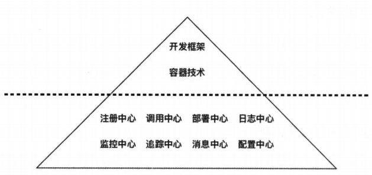

## 微服务基本概念

传统架构存在的问题：

* 系统资源浪费
* 部署效率太低
* 技术选型单一

微服务的要求：

* 根据业务模块划分服务种类
* 每个服务可独立部署且相互隔离
* 通过轻量级 API 调用服务
* 服务需要保证良好的高可用性

微服务架构的特点：

1. 微小粒度
2. 职责单一性
3. 运行性隔离
4. 管理自动化

微服务架构的挑战：

1. 运维要求较高
2. 分布式的复杂性
3. 部署依赖较强
4. 通信成本较高

## Spring boot

### Spring boot 的应用场景

1. 传统的 Web MVC 架构
2. 前后端分离架构
3. 微服务架构

### Spring boot 提供的生产级特性

1. 端点
2. 健康检查
3. 应用基本信息
4. 跨域——添加`@CrossOrigin`注解
5. 外部配置
6. 远程监控

## 网关

由于`Node.js`采用的是单线程模型，不适合做`CPU`密集型，因此适合开发`I/O`密集型，
充分利用了事件驱动与异步非阻塞技术，嗯哪个支持大量的并发连接，从而提高了整个系统
的吞吐率

### 反向代理的应用场景

1. 使静态资源与动态资源分离
2. 实现 AJAX 跨域访问
3. 搭建统一网关接口

## ZooKeeper

`ZooKeeper`目标就是将那些复杂切容易出错的分布式一致性架构加以封装，构成一个高效
且可靠的服务，并为用户提供一系列简单易用的接口

### ZooKeeper的五大特性

1. 顺序性
2. 原子性
3. 单一性
4. 可靠性
5. 实时性

Zab 协议分为两个阶段

* Leader Election
* Atomic Broadcast

只要集群中存在超过半数以上的节点可以正常工作，那么整个集群就能够正常对外提供服务

## Docker

### Docker的四大特性

1. 快速运行
2. 节省资源
3. 便于交付
4. 容易管理

## 架构师

架构师的职责是：制定规范+指导落地

### 微服务架构师需要具备以下基本职责：

1. 分析业务需求并切分微服务边界
2. 定义架构规范与文档标准
3. 确保微服务架构顺利落地
4. 改善微服务架构并提高开发效率

### 微服务架构师需要克服的挑战：

1. 架构需要适应不断变化的业务需求
2. 架构具备稳定性、扩展性、安全性、容错性等
3. 使技术团队深刻理解微服务思想
4. 展现微服务架构的价值

**微服务时SOA的一种落地方案**

轻量级必须包含三个特征：易用、快速、稳定

### 根据业务切分微服务边界

1. 梳理业务流程
2. 抽取公共服务
3. 定义业务模型
4. 设计数据模型
5. 定义服务接口

## 消息队列

### 消息的流动的步骤

1. 请求者发送请求消息至请求队列中
2. 应答者从请求队列中获取请求消息
3. 消费者发送应答消息至应答队列中
4. 请求者从应答队列中获取应答消息
