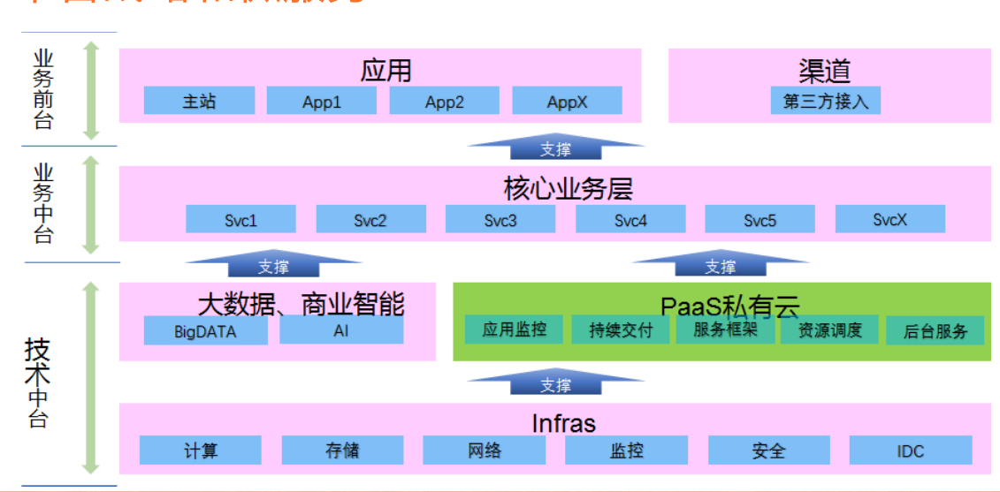
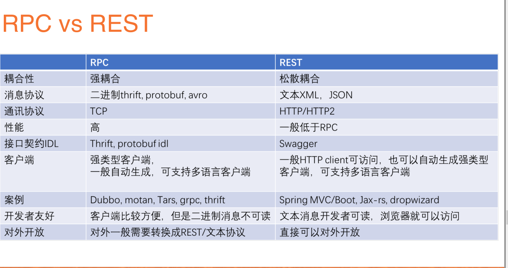
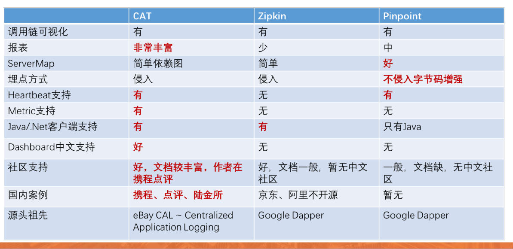

```yaml
titile: 微服务
```

## 微服务架构

- 一组小的服务

- 独立的进程

- 轻量级通信

- 基于业务能力

- 独立部署：每个团队各自独立，各自进行部署

- 无集中式管理

本质上不能脱离SOA

### 微服务的利弊

#### 利

* 强模块化边界

* 可独立部署

* 技术多样性

#### 弊

* 分布式系统负责性

* 最终那个一致性

* 运维负责性

* 测试复杂性

### 康威法则

设计系统的组织，其产生的架构设计等价余组织间的沟通结构

单块优先，后期转换到微服务上，前期不能很好的划分服务之间的边界


Build it, run it.



#### 服务发现模式

* 独立`Load Balancer`
* 进程`内Load Balancer`
* 主机独立进程`Load Balancer`

### 网关

#### 功能

* 反向路由
* 认证安全
* 限量熔断
* 日志监控

#### Zuul 过滤器

* Pre routing filters
* Routing filters
* Post routing filters





