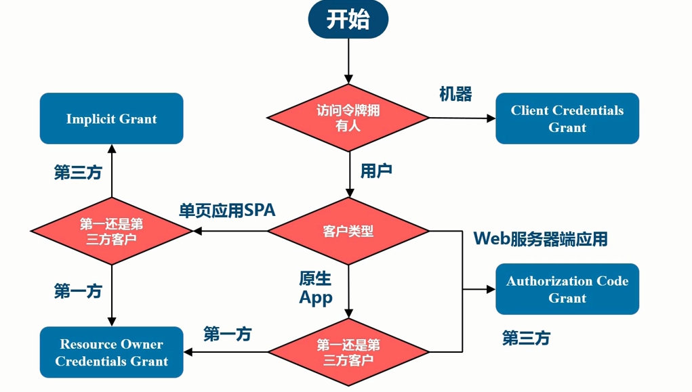

## 微服务架构

-   一组小的服务

-   独立的进程

-   轻量级通信

-   基于业务能力

-   独立部署：每个团队各自独立，各自进行部署

-   无集中式管理

本质上不能脱离 SOA

### 微服务的利弊

#### 利

-   强模块化边界

-   可独立部署

-   技术多样性

#### 弊

-   分布式系统负责性

-   最终那个一致性

-   运维负责性

-   测试复杂性

### 康威法则

设计系统的组织，其产生的架构设计等价余组织间的沟通结构

单块优先，后期转换到微服务上，前期不能很好的划分服务之间的边界

Build it, run it.

#### 服务发现模式

-   独立`Load Balancer`
-   进程内`Load Balancer`
-   主机独立进程`Load Balancer`

### 网关

#### 功能

-   反向路由
-   认证安全
-   限量熔断
-   日志监控

#### Zuul 过滤器

-   Pre routing filters
-   Routing filters
-   Post routing filters

## OAuth2 参考书目

-   OAuth2 in Action
-   OAuth2 2.0 Cookbook

### 应用场景

1. 开发系统间的授权
2. 现代微服务的安全
3. 企业内部应用认证授权

OAuth2 不是一个认证协议，其不告诉任何用户信息。也没有定义授权处理机制，也没有定义 Token 格式和加密方法。

OAuth2 仅仅是一个授权框架，仅用于授权代理

### 授权类型选择

### 访问令牌的类型

1. By reference token （透明令牌）
2. By value token （自包含令牌）

JWT 是自解释，自校验的

### OpenID

(Identity,Authentication)+OAuth2.0 = OpenID Connect

## 配置中心

### 传统应用配置的问题

-   主要采用本地文件静态配置
-   配置散乱、格式不标准
-   易发生事故
-   配置修改麻烦，周期长
-   配置信息缺少安全审计和版本控制

### 现代配置核心需求

1. 交付件和配置分离
2. 抽象标准化
3. 集中式
4. 高可用
5. 实时性
6. 治理
