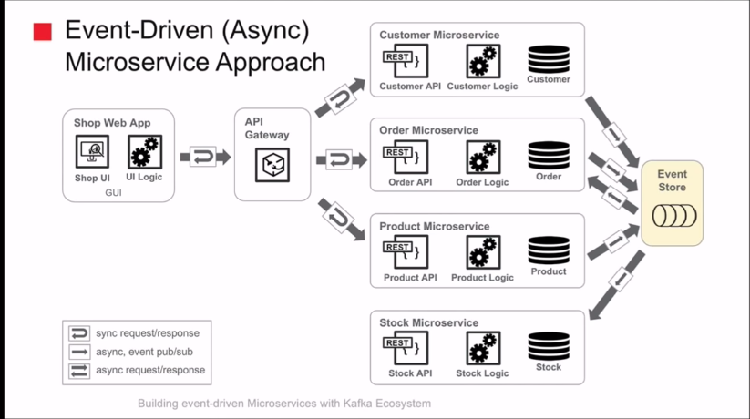
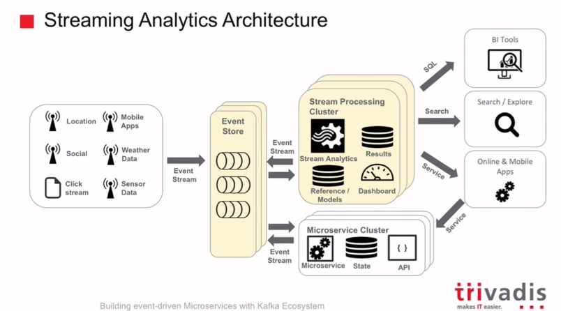
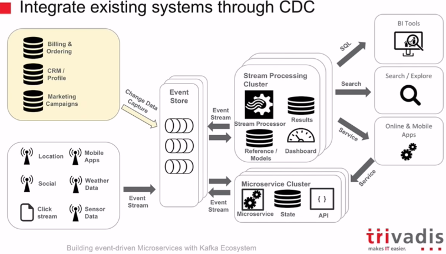

## [从单体应用到微服务的开发旅程](https://www.bilibili.com/video/av60528090)

Refactoring a monolith is an activity that unlocks team productivity and business scalability.

Latency cannot be ignored anymore, It compounds over many API calls.

当我们解耦服务后，我们就能将 API 网管作为服务端与客户端直接的路由，这就可以使得我们无须升级客户端即可以将请求路由到这些新服务下面。

如果不能实现业务目标同时协调新技术的使用，那么我们也就没办法在技术转型上走下去

不同的团队、产品以及业务需求，它们共同的目标都是（所开发的程序单元）要成为彼此独立的存在

## [Building event-driven (Micro)Services with Apache Kafka by Guido Schmutz](https://www.youtube.com/watch?v=IR1NLfaq7PU)

problem in lower end of chain have a ripple effect on other service:

-   crash of service
-   overloaded service / slow response time
-   change of interface

Integrate exisiting systems through CDC

-   Capture changes directly on database
-   Change Data Capture => think like a global database tigger
-   Transform existing systems to evnet producer

Command Query Responsibility Segregation(CQRS):

-   _commands_ that trigger changes in state
-   _queries_ that provide read access to the state of resource

## [响应式关系数据库连接](https://www.bilibili.com/video/av59225438)

### Design Principals

-   Utilize Reactive Streams Types and patterns
-   Be completely non-blocking, all the way to database
    -   Untilize wire-protocal features where avaliable
-   Shaink the driver SPI to the minimal set of operations that are implementation speciafic, regardless of usability
-   Enable multiple 'Humane' APIs to be built on top of the driver
