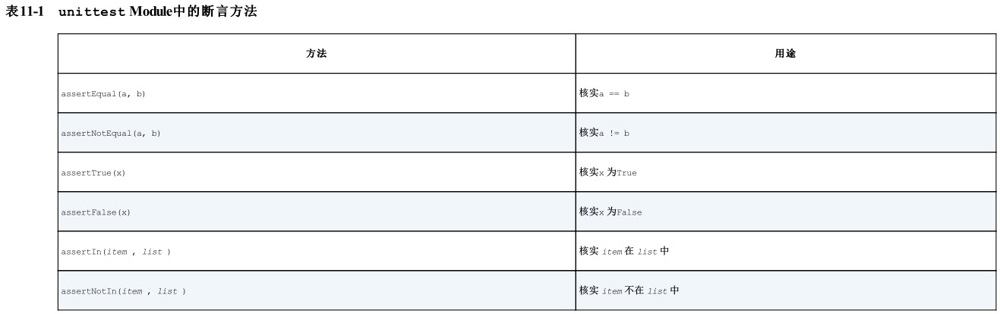

## 一 变量和基本类型

### 命名

在 Python 中使用变量时，需要遵守一些规则和指南。违反这些规则将引发错误，而指南旨在让你编写的代码更容易阅读和理解。请务必牢记下述有关变量的规则:

* 变量名只能包含字母、数字和下划线。变量名可以字母或下划线打头，但不能以数字打头
* 变量名不能包含空格，但可使用下划线来分隔其中的单词
* 不要将 Python 关键字和函数名用作变量名，即不要使用 Python 保留用于特殊用途的单词，如 print 。
* 变量名应既简短又具有描述性
* 慎用小写字母 l 和大写字母 O ，因为它们可能被人错看成数字 1 和 0 。

Python 解释器不会对代码做拼写检查，但要求变量名的拼写一致

### 二 字符串

Python 使用加号（ + ）来合并字符串。这种合并字符串的方法称为 拼接 。通过拼接，可使用存储在变量中的信息来创建完整的消息。

Python 能够找出字符串开头和末尾多余的空白。要确保字符串末尾没有空白，可使用方法 rstrip() 。你还可以剔除字符串开头的空白，或同时剔除字符串两端的空白。为此，可分别使用方法 lstrip() 和 strip() 。

Python 3 中的 print 是一个函数，因此括号必不可少。

### 数值

在 Python 中，可对整数执行加（ + ）减（ - ）乘（ * ）除（ / ）运算。

Python 将带小数点的数字都称为 浮点数 。大多数编程语言都使用了这个术语，它指出了这样一个事实：小数点可出现在数字的任何位置。每种编程语言都须细心设计，以妥善地处理浮点数，确保不管小数点出现在什么位置，数字的行为都是正常的。从很大程度上说，使用浮点数时都无需考虑其行为。你只需输入要使用的数字， Python 通常都会按你期望的方式处理它们。

### 注释

编写注释的主要目的是阐述代码要做什么，以及是如何做的。在开发项目期间，你对各个部分如何协同工作了如指掌，但过段时间后，有些细节你可能不记得了。当然，你总是可以通过研究代码来确定各个部分的工作原理，但通过编写注释，以清晰的自然语言对解决方案进行概述，可节省很多时间。要成为专业程序员或与其他程序员合作，就必须编写有意义的注释。

### Python之禅

使用import this可以查看

```txt
Beautiful is better than ugly.
Explicit is better than implicit.
Simple is better than complex.
Complex is better than complicated.
Flat is better than nested.
Sparse is better than dense.
Readability counts.
Special cases aren't special enough to break the rules.
Although practicality beats purity.
Errors should never pass silently.
Unless explicitly silenced.
In the face of ambiguity, refuse the temptation to guess.
There should be one-- and preferably only one --obvious way to do it.
Although that way may not be obvious at first unless you're Dutch.
Now is better than never.
Although never is often better than *right* now.
If the implementation is hard to explain, it's a bad idea.
If the implementation is easy to explain, it may be a good idea.
Namespaces are one honking great idea -- let's do more of those!
```

## 四 列表

列表 由一系列按特定顺序排列的元素组成。

有时候，你不知道要从列表中删除的值所处的位置。如果你只知道要删除的元素的值，可使用方法 remove() 。

Python 方法 sort() 让你能够较为轻松地对列表进行排序。

你还可以按与字母顺序相反的顺序排列列表元素，为此，只需向 sort() 方法传递参数 reverse=True 。

要保留列表元素原来的排列顺序，同时以特定的顺序呈现它们，可使用函数 sorted() 。函数 sorted() 让你能够按特定顺序显示列表元素，同时不影响它们在列表中的原始排
列顺序。

要反转列表元素的排列顺序，可使用方法 reverse() 。

 Python 通过使用缩进让代码更易读；简单地说，它要求你使用缩进让代码整洁而结构清晰。在较长的 Python 程序中，你将看到缩进程度各不相同的代码块，这让你对程序的组织结构有大致的认识。

## 五 if语句

每条 if 语句的核心都是一个值为 True 或 False 的表达式，这种表达式被称为 条件测试 。 Python 根据条件测试的值为 True 还是 False 来决定是否执行 if 语句中的代码。如果条件测试的值为 True ， Python 就执行紧跟在 if 语句后面的代码；如果为 False ， Python 就忽略这些代码。

在 Python 中检查是否相等时区分大小写，如果大小写很重要，这种行为有其优点。但如果大小写无关紧要，而只想检查变量的值，可将变量的值转换为小写，再进行比较：

要检查是否两个条件都为 True ，可使用关键字 and 将两个条件测试合而为一；如果每个测试都通过了，整个表达式就为 True ；如果至少有一个测试没有通过，整个表达式就
为 False 。

关键字 or 也能够让你检查多个条件，但只要至少有一个条件满足，就能通过整个测试。仅当两个测试都没有通过时，使用 or 的表达式才为 False 。

**python的检查支持短路检查，可以将频繁测试的放在最前面**

### if语句

简单的if语句

```python
if conditional_test:
  do something
```

## 六 字典

在 Python 中， 字典 是一系列 键 — 值对 。每个 键 都与一个值相关联，你可以使用键来访问与之相关联的值。与键相关联的值可以是数字、字符串、列表乃至字典。事实上，可将任何 Python 对象用作字典中的值。在 Python 中，字典用放在花括号 {} 中的一系列键 — 值对表示

对于字典中不再需要的信息，可使用 del 语句将相应的键 — 值对彻底删除。使用 del 语句时，必须指定字典名和要删除的键。

要编写用于遍历字典的 for 循环，可声明两个变量，用于存储键 — 值对中的键和值。对于这两个变量，可使用任何名称。

for 语句的第二部分包含字典名和方法 items() ，它返回一个键 — 值对列表。接下来， for 循环依次将每个键 — 值对存储到指定的两个变量中。

## 七 用户输入和while循环

函数 input() 让程序暂停运行，等待用户输入一些文本。获取用户输入后， Python 将其存储在一个变量中，以方便你使用。函数 input() 接受一个参数：即要向用户显示的 提示 或说明，让用户知道该如何做。

处理数值信息时， 求模运算符 （ % ）是一个很有用的工具，它将两个数相除并返回余数。

在要求很多条件都满足才继续运行的程序中，可定义一个变量，用于判断整个程序是否处于活动状态。这个变量被称为 标志 ，充当了程序的交通信号灯。你可让程序在标志为 True 时继续运行，并在任何事件导致标志的值为 False 时让程序停止运行。这样，在 while 语句中就只需检查一个条件 —— 标志的当前值是否为 True ，并将所有测试（是否发生了应将标志设置为 False 的事件）都放在其他地方，从而让程序变得更为整洁。

## 八 函数

编写函数时，可给每个形参指定 默认值 。在调用函数中给形参提供了实参时， Python 将使用指定的实参值；否则，将使用形参的默认值。因此，给形参指定默认值后，可在函数调用中省略相应的实参。使用默认值可简化函数调用，还可清楚地指出函数的典型用法。

## 九 类

面向对象编程 是最有效的软件编写方法之一。在面向对象编程中，你编写表示现实世界中的事物和情景的类，并基于这些类来创建对象。编写类时，你定义一大类对象都有的通用行为。基于类创建 对象 时，每个对象都自动具备这种通用行为，然后可根据需要赋予每个对象独特的个性。使用面向对象编程可模拟现实情景，其逼真程度达到了令你惊讶的地步。根据类来创建对象被称为实例化 ，这让你能够使用类的实例。

## 十 文件和异常

很多程序都要求用户输入某种信息，如让用户存储游戏首选项或提供要可视化的数据。不管专注的是什么，程序都把用户提供的信息存储在列表和字典等数据结构中。用户关闭程序时，你几乎总是要保存他们提供的信息；一种简单的方式是使用模块 json 来存储数据。

## 十一 测试


