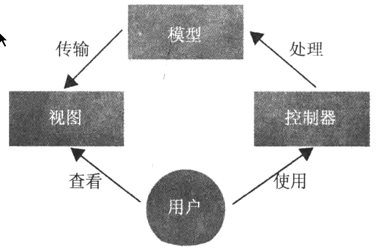
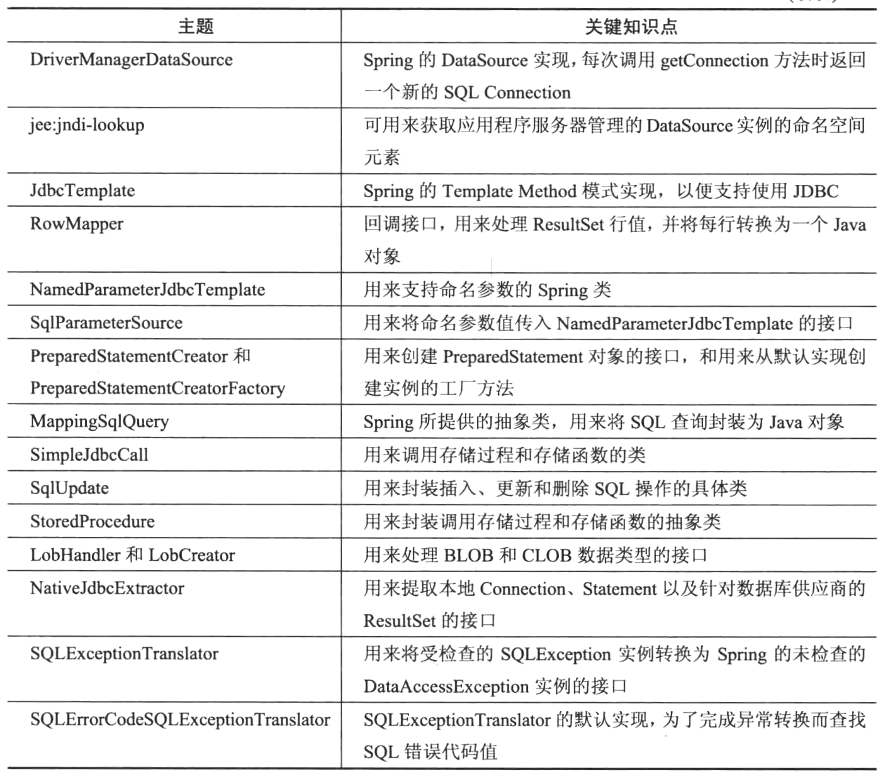
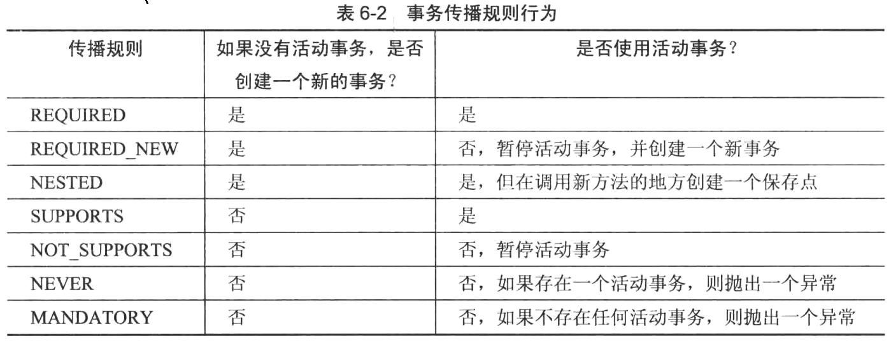
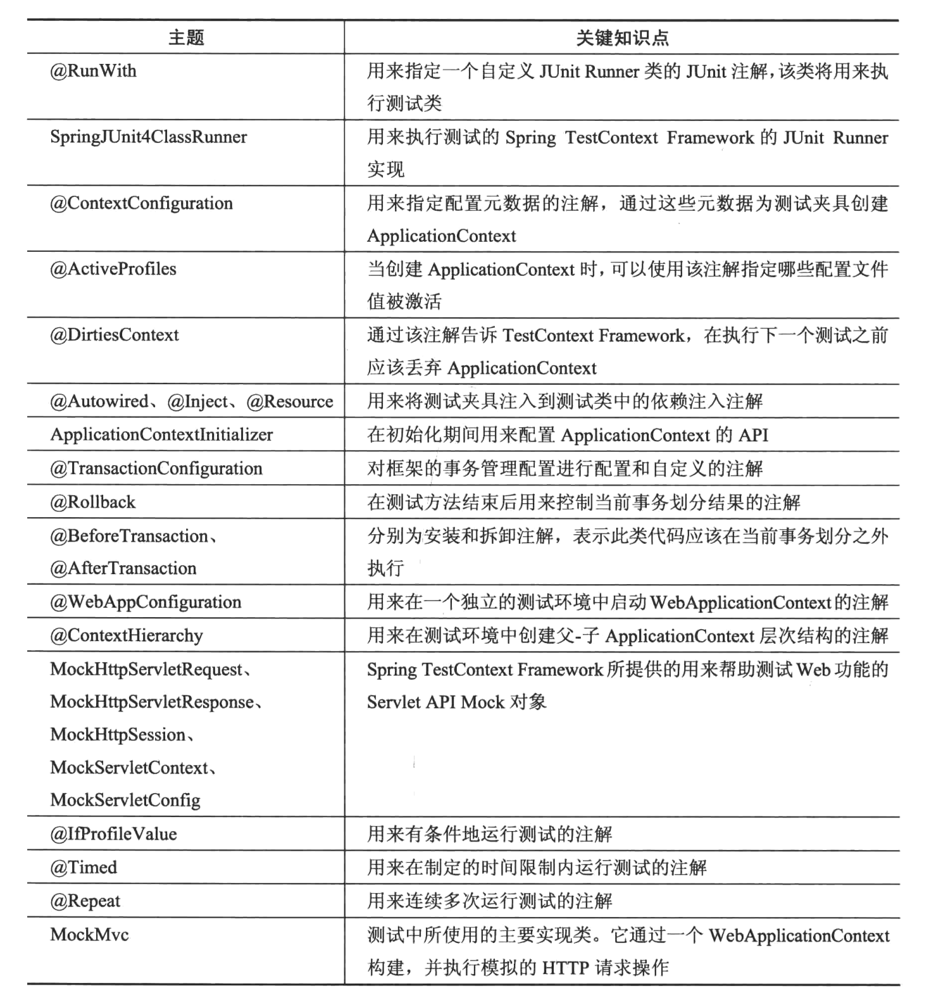

# spring入门经典

## 第一章POJO编程模式、轻量级容器和控制反转

容器：在该环境中，所有组件都被创建和装配，并且提供了所需服务的中间件服务

控制反转：在组件类中，不需要使用新的操作符来实例化依赖组件，而是在运行时由容器实例将依赖组件注入组件。因此，对依赖项的控制由组件转到容器。

控制反转的两种形式：依赖查找和依赖注入

中间件服务：在每一个应用程序中都会出现的需求，这些需求独立于业务需求

## 第二章 使用Spring进行依赖注入

Spring Application Framework的核心是IoC容器。


所有的Bean都被定义在`<beans>`元素中，而每一个Bean则使用`<bean>`元素进行定义。Bean的名称由id特性定义。应用程序或者配置元数据中的其他Bean定义可以通过名称访问相关的Bean。

`@Autowired`通常用来指定在运行时被Spring容器所注入的Bean依赖。

Spring容器也是一个Java对象，在某些特定的时间点被创建，并允许管理应用程序的其他部分。在独立的应用程序中，可以使用编程方法，而在Web应用程序中，使用声明方法则是更好的选择。


在工厂方法中，首先通过调用Setter方法设置所需的依赖项，然后使用具体类创建一个Bean并将其返回。此外，依赖项还可以通过构造函数参数的形式赋予。

工厂方法的返回类型被定义为接口而不是具体类。

默认情况下，没一个Bean都有一个被称为单实例作用域的单个实例。Spring在运行时动态地扩展`@Congfiguraton`类中多次调用工厂方法，在第一次创建了Bean实例之后就不会创建任何新的Bean实例。对于连续调用，工厂方法将会返回相同的Bean实例。

`@Service`除了将一个类定义为一个Bean之外，再无其他特殊含义。而注解`@Repository`能够启用与Spring数据访问相关的其他功能。

默认情况下，Bean的名称派生自简单的类名但首字母小写。

Spring通过扫描类路劲中存在的类，尝试在启动期间识别带有注解`@Component`的类及其派生类。

需要将`<context:component-scan/>`放到Bean配置文件中。为此，需要通过在元素`<beans>`的上面添加架构位置指令来启用上下文命名空间功能。

每一个Spring模块都有自己的命名空间支持，并针对不同的目的提供了多个命名空间元素。

## 依赖注入

### Setter注入

Spring需要尽可能多地处理必要的类型转换。Spring通过使用内置的属性编辑器来完成转换工作，此外，还可以添加自定义编辑器，以便处理默认情况下Spring不能处理其他类型转换。

### 构造函数注入

Spring容器首先查看Bean定义中的`<constructor-arg/>`元素，并识别`<constructor-arg/>`元素指定的依赖项，然后使用Java反射尝试找到一个合适的构造函数。`<contructor-arg/>`元素的顺序并不重要。在确定了合适的构造函数之后，Spring容器将依赖项作为输入参数值并传入调用构造函数。有时需要提供一个index特性。

**构造函数注入的其中一个缺点是无法处理循环依赖**

Spring容器的启动过程大致可分为两个主要阶段：

1. 容器处理配置元数据并建立元数据中存在的Bean定义，在该过程中还会对这些Bean定义进行验证
2. 完成Bean的创建，然后完成依赖注入

一个Bean在被完全 创建且自己的依赖项被注入之前是不会作为一个依赖项被注入到其他Bean中去。

Spring容器提供了两种不同形式的Bean重写机制：

1. 发生在Bean配置元数据文件级别
2. 发生在容器级别

可以在基于XML的配置中通过使用`<bean>`元素的depends-on特性来指定Bean b在Bean a之前被创建。只有在无状态Bean的情况下，当该Bean使用了depends-on特性时，depends-on特性中所列举的Bean才被销毁。（注解形式为`@DependsOn`）。当在类级别使用`@DependOn`注解是，通常在组件扫描期间进行处理，此时只有在`@DependOn`注解内指定的Bean被创建之后才会创建本类，否则就不会创建本类。

自动装配中有三种模式：ByType、ByName和constructor。如果有多个Bean实例合适自动转配DAO某一个特定属性，那么依赖注入将会失败。一种方法是从自动转配的候选Bean中进行过滤，并注入剩下的Bean，可以使用`autowire-candidate`

Spring提供了`Qualifier`注解，当将`@Qualifer`注解与`@Autowired`和`@Bean`注解放置在一起时，自动装配模式将变为byName

`@Qualifier`注解接受了一个String值，通过该值乐易更改秒人的限定值。这样一来，可以根据不同的限定，可以自动转配那些名称与属性名称并不匹配的其他Bean。

自动装配仅适用于对其他Bean的依赖，而不适用于纯粹值，对于这些值，可以在字段或Setter方法上使用`@Value`注解。`@Value`注解接受一个String值，该值指定了将要被注入DAO内置的Java类型属性的值，而必要的类型转换则由Spring容器处理。其还可以用于表达式驱动的依赖注入。

在Spring容器控制之外的对象获取在Spring容器中的Bean


不管如何努力，某些情况下总会需要从处于Spring容器控制之外的其他对象访问Bean，在这种情况下，这些对象首先应该获取该对该环境中ApplicationContext实例的引用，对于独立的应用程序，应该由开发人员显示处理该任务。对于web应用程序，Spring提供了一个WebApplicationContextUtils的实用工具类，该类中的方法可以返回Web应用程序的ApplicationContext实例。

## Spring管理Bean

在基于XML的配置文件中，使用id特性将一个名称分配个一个Bean，相同的XML文件中不能复制同一个名称，在其他文件中XML文件可以将相同的名称分配给另一个Bean定义，这种情况下，Bean重写机制开始发挥作用。

基于注解的配置`@Component`及其派生接收一个Strting值作为Bean名称，如果没有提供名称，那么默认情况下一个简单的类名（第一个字符小写）将成为Bean名称。

创建Bean的方法：

1.  调用相关类中一个可用的构造函数
2.  调用可用的静态或实例工厂方法
3.  使用Spring自带的FactoryBean接口

默认情况下，由Spring容器创建的所有Bean都是Singleton作用域。当不同的Bean与不同的层相对应的时，可用使用Singleton作用域，此时创建的实例都是无状态实例，在同一时间服务于不同的请求。

Spring的作用域：

1. Singleton
2. protype
3. Request
4. Session
5. globalSession

当定义Request作用域Bean和Session作用域Bean时，必须在`<Bean>`元素中放置`<aop:scoped-proxy/`元素作为一个子元素。


`@Scope`注解被用来在类级别或工厂级别指定当前Bean定义的作用域，其通过一个String值标示Bean定义的作用域，此外还可以接受第二个参数，该参数可以修改代理生成模式。

一些Bean可能只在特定的场合或备选方案中使用，在其他情况下并不需要。在这种情况下，预先初始化可能会导致不必要的堆内存消耗

如果在带有`@Component`注解的类级别或者在带有`@Bean`注解的工厂方法级别将`@Lazy`特性设置为true，那么Bean定义就是延迟初始化

生命周期回调：

1. 基于XML的配置的``元素有init-method和destory-method特性，它们接收Bean类中的方法名称作为特性值
2. Spring还支持JSR-250 Common Java注解`@PostConstruct`和`PreDestory`注解
3. 使用Spring提供的两个特殊接口：InitializingBean和DisposableBean,，分别声明了afterPropertiesSet()和destory()方法

有时可能需要根据运行时环境来定义Bean，因为在一个配置元数据文件中不能有两个同名的Bean定义，所有首先必须创建两个不同的Bean配置元数据文件，在每个文件中包括了针对特定环境或平台的Bean定义，通常此时还需要创建第三个带有一个导入元素的Bean配置文件，该元素根据一些特定平台值导入两个元数据中的一个。

Spring 3.1引入了Bean定义配置文件。在基于XML的配置文件中，该配置文件支持在一个`<beans>`元素中定义另一个`<beans>`元素。


# 第三章 使用Spring MVC构建Web应用程序

万维网的三个核心元素：HTML，HTTP和URI




DispatchServlet的定义包含在Web应用程序的部署描述文件中，即web.xml文件

```xml
<servlet>
	<servlet-name>springmvc</servlet-name>
	<servlet-class>org.springframework.web.servlet.DispatcherServlet</servlet-class>
  	<load-on-startup>1</load-on-startup>
</servlet>

<servlet-mapping>
	<servlet-name>springmvc</servlet-name>
	<url-pattern>*.mvc</url-pattern>
</servlet-mapping>
```

默认情况下，该配文件的解析机制使用了一个默认的命名约定。Servlet默认在WEB-INF文件夹下查找名为{servlet-name}-servlet.xml的配置文件。

如果使用的是Spring 3.1，还可以在web-fragment.xml文件中定义Servlet，从而向应用程序引入可拔插功能

通过实现ServletContextAware接口，在WebApplicationContext内注册的Bean还可以访问Servlet的上下文。

在Spring 3.2之前，需要在XML配置文件中声明`<mvc:annotation-driven/>`标签，以便将请求调度配置到控制器类；并且需要将DefaultAnnotationHandlerMapping和AnnotationMethodHandlerAdapterBean注册到应用程序上下文，以便请求处理。

@Controller用来表示被注解的类作为MVC框架的一个Controller的主要注解

@RequestMapping注解被用来将用户的请求映射到处理器类或方法。

@ModeAtrribute注解使用一个向视图公开的键将一个返回值与一个参数绑定起来

@PathVariable注解将一个方法参数绑定到一个URL模板

@ControllerAdvice注解能够让我们将代码集中到一个地方，以便跨控制器共享代码

@InitBinder注解确定用来出事化WebDataBinder

@ExceptionHandler注解可以订阅方法来处理在控制类中发生的异常

如果对一个字段同时应用了注解的消息特性和隐式键定义，那么隐式定义的优先级高于注解和消息特性

Spring提供了两种方法来处理文件上传：

1. 使用Commons FileUpload多部分请求流程
2. 使用Servlet 3.1多部分请求流程

默认情况下，Spring并不会处理任何多部分请求，所有为了启用多部分处理，首先需要在Web应用程序的上下文中定义一个多部分解析器，DispatcherServlet可以访问该解析器。Bean名称应该被定义multipartResolver。

因为一般来说应该在一个公共的中心位置处理异常，所以创建一个可以处理异常的全局方法显得很有意义（@ControllerAdvice）

为了初始化区域设置解析器，Dispatcher Servlet在应用程序上下文中查找一个名为localeResolver的Spring Bean。如果没有找到该Bean，则配置使用AcceptHeaderLocaleResolver Bean，其使用键accept-language从HTTP请求头中提取区域设置信息，而该区域设置信息有客服端浏览器发送。处理区域设置信息的一个更好的方法是将其存储在用户会话中。SessionLocaleResolver类通过一个预定义会话特性来存储该信息。

更改区域设置的另一种方法是使用CokieLocaleResolver类，该类在客户端搜索一个Cookie，如果找到，则设置区域设置。

Spring 4.0引入了扩展自LocaleResolver的LocaleContextResolver接口，从而支持丰富的区域设置上下文。

主题架构包含三个主要机制：支持主题的资源包、主题解析器和主题更改拦截器。

DispatcherServlet将在应用程序上下文中查找一个名为themeResolver的Spring bean，如果该Bean不存在，则配置使用FixedThemeResolver


# 第四章 使用Spring进行JDBC数据访问

JDBC没有对不同的数据库供应商所提供的SQL符号进行完全抽象。一般来说，开发人员需要编写特定于自己所使用的关系数据库供应商的SQL语句

当使用JDBC时，通常会长数据访问层使用以下类似模式：

```java
try {
  // obtain database connection
  // start a transaction
  // create and execute the query
  // process qurey result
  // commit the transaction
} catch (SQLException e) {
  // handle SQL execeptions, perform transaction rollback
} finally {
  // close db resource like connections, statements
}
```

Spring主要使用三种主要方法来提供数据访问操作（通过使用JDBC来完成）：

* 使用基于Template Method模式的使用程序类，并通过删除应用程序中重复的数据访问代码块，正确处理资源清理等操作，从而更容易地完成JDBC操作。
* 通过使用诸如SimpleJdbcInsert和SimpleJdbcCall之类的类及数据库元数据，简化查询
* 通过使用MappingSqlQuery、SQLUpdate和StroredProcedure类，将数据库操作表示为可重复使用的Java对象

使用Spring的DriverManagerDataSource类定义一个dataSource Bean，该类是javax.sql.DataSource接口的简单实现。但是不要在生产环境中使用。

Spring对创建华为使用轻量级的数据库实例提供了良好的支持，为此提供了EmbeddedDatabase接口。

可以使用SQL脚本填充嵌入式数据库，而该脚本可以作为输入参数提供。此时，需要在根类路径中创建schema.sql个data.sql脚本文件，以便上面所述的测试类可以正常工作。

对于企业级的Java生产环境来说，使用带有连接池功能的DataSource实例可能更加合适。（C3P0或DBCP）。

如果想要使用有应用程序服务器管理的DataSource实例，可以使用Spring的JEE架构命名空间支持，并借助于JNDI查找访问该实例。

每次应用程序启动时都会运行初始化脚本，如果只想执行一次初始化脚本，则必须在应用程序之外执行初始化脚本或者有条件的运行初始化脚本。

Spring的JDBC支持的核心类是JdbcTemplate。该类简化了JDBC的使用并有助于避免常见错误的发生。可以使用JdbcTemplate执行SQL查询或者插入、更新和删除语句。他执行核心的JDBC工作流，在ResultSets上进行迭代操作以及获取JDBC异常并将其转换为Spring提供的泛型的、可提供更多信息的DataAccessException结构。应用程序代码只需提供SQL以及必要的ResultSet处理逻辑即可。

JdbcTemplate被定义为一个Spring管理的Bean。该Bean是线程安全的，并且可以被不同的数据访问对象共享，因此，它被定义成单例。JdbcTemplate Bean的主要依赖是一个DataSource对象。

可以使用RowMapper将ResultSet中返回的每一行映射到一个结果对象。

QuerForList()方法执行查询并返回一个List，其中元素是使用列名作为键的Map

NamedParameterJdbcTemplate实际上封装了JdbcTemplate，所以几乎所以的艰苦工作都由JdbcTemplate来完成。

SQLParameterSource接口有多个不同实现，而MapSQLParameterSource是其中之一。它实际上封装了一个普通的Map，所有键是命名参数名，而值是命名参数值。此外BeanPropertySqlParemeterSource实现封装了JavaBean对象，而该对象的属性被用作命名参数值。

IN字句在SQL标准中仅支持100个以内的占位符作为查询参数。

使用SimpleJdbcCall和StoredProcedure类调用存储过程和存储函数。

可以使用batchUpdate进行批处理

访问特定于供应商的JDBC方法：

```java
Connection con = jdbcTemplate.getDataSource().getConnection();
Connection nativeCon = jdbcTemplate.getNativeJdbcExtractor().getNativeConnection(con);
```

当使用java.sql.Statement执行一个查询时，数据库首先获取查询字符串，然后在执行之前进行解析、编译以及计算执行计划。

通过使用Spring，可以将任意SQL查询封装为一个Java对象。为此，Spring提供了抽象类MappingSQLQuery，线程安全，并且可以被应用程序中的其他DAO对象所共享。

在实现可重复使用的查询对象的过程中，第一步是向其超类构造函数传入一个可用的dataSource Bean以及一个SQL查询语句。第二步，通过调用declareParameter(...)方法为构造函数提供SQL参数，而这些参数使用了SQLParameter实例。最后一步是调用compile()方法。

Spring JDBC所抛出的所有异常都是DataAccessException（RuntimeException类型）的子类，所有不必显示处理。任何被底层JDBC API抛出的受检查的SQLException都还与DataAccessException框架子类相映射。

可以使用Spring的JDBC支持所提供的SQLExceptionTranslator自动将SQLException转换为特定于Spring的DataAccessException。SQLExceptionTranslator类实际上是一个接口，并且有多个实现。

Spring所使用的默认实现是SQLErrorCodeSQLExceptionTranslator，而该实现使用了特定供应商的错误代码。错误代码可以通过SQLErrorCodeFactory类获取，该工厂类从项目类路径中加载一个sql-error-codes.xml文件。

SQLExceptionTranslato接口的另一个公共实现是SQLStatteSQLExceptionTranslator，它使用了抛出SQLException中的SQL状态信息。

默认情况下，如果JdbcTemplate的dataSource依赖得到满足，那么JdbcTemplate会创建并使用SQLErrorCodeExceptionTranslator；否则，就会就会SQLStateCodeExceptionTranslator。其结果就是，在默认情况下，如果数据访问对象正在使用JdbcTemplate，就可以利用自动异常转换功能。



# 第五章 通过Spring使用JPA进行数据访问

范式不匹配：

1. 对象之间的相互管理
2. 粒度
3. 继承和多态行为相关

一个成熟的ORM工具该具备以下功能：

* 对象模型和关系模型之间的元数据映射
* 用来在对象上执行相关操作的CRUD API
* 一种对象查询语言
* 不同的数据获取策略和对象网络遍历功能，以便提高内存使用率及数据获取时间的性能

对象-关系映射通常发生在以下两者之间：

* 类和表
* 类的属性和表的列
* 对象关联和外键
* Java类型和SQL类型

通过`@GeneratedValue`注解的strategy属性指定实体类的ID生成策略。如果没有指定，JPA则默认使用底层数据库提供的程序的默认策略。

默认情况下，类中定义的任何特性都被假定为持久化。如果不想让某一属性持久化，则可以用`@Transient`注解或者transient修饰符来标记它。

对象之间存在的多种不同类型的关联：

* 一对一（1:1）
* 多对一（M:1）
* 一对多（1:M）
* 多对多（M:M）


默认情况下，JPA将Date类型的属性映射到timestamp。

默认情况下，JPA处理Java枚举类型，并将带有序号的枚举类型映射到数据库中带有数值SQL类型的列。然而，如果想要保留枚举值的名称，可以使用带有EnmuType.STRING属性值的`@Enumerated`注解。

可以使用`@CollectionTable`注解指定用来保存集合值的表。

JPA有两种事物模式：一种是RESOURCE_LOCAL，另一种是JTA

如果之间连接有Hibernate管理，那么提供一个方言类是可选的。因为Hibernate可以通过查看JDBC驱动程序类知道使用的是哪一个数据库，所以可以自己推断出对应的方言类。

JPA或者ORM的另一个重要特征是传递性持久化。对于在使用EntityManager实例加载的实体实例上锁完成的更改，JPA会进行跟踪。被更改的实体标记为“脏数据”。该过程称为自动脏数据检查。在实体上完成的更改会导致更新语句，当开发人员提交事务时，JPA会执行这些更新语句。只要实体与EntityManager相连接，并且EntityManager保持打开状态，那么实体就会被跟踪。当关闭EntityManager时，加载的实体将分离，而它们的状态更改不会被跟踪。此时需要一个新的EntityManager实例并使用merge操作重新加载或者重新关联它们。

使用Spring的JPA带来的好处：

* 更容易且更加强大的持久化单元配置
* 自动EntityManager管理
* 更容易测试
* 常见的数据访问异常
* 集成事务管理

Spring提供三种不同的方法来配置EntityManagerFactory：

* LocalEntityManagerFactoryBean
* 通过JNDI进行EntityManagerFactory查找
* LocalContainerEntityManagerFactoryBean

@PersistenceUnit注解表示对EntityManagerFactory的依赖，而@PersistenceContext则表示对容器管理的EntityManager实例的依赖。

Spring可以处理数据访问层中抛出的不同类型的数据访问异常，并将这些异常转换为一个Spring定义的标准的数据访问异常层次结构，从而减轻开发人员的工作量。

为了使用Spring的异常处理和转换能力，需要使用`@Repository`注解来标记DAO，然后，需要从PersistenceExceptionTranslationPostProccessor类创建一个Bean定义，以便Spring通知DAO Bean，捕获特定技术的数据访问异常，并将异常转换为DataAccessException层次结构。


# 第六章 使用Spring管理事务

事务隔离的属性（ACID）：

* 原子性：在任何事务中都可能在数据上执行多个操作。
* 一致性：为了让一个系统保持一致，一个活动事务结束之后底层数据库必须处于一致状态。
* 隔离性：隔离性定义了如何保护未提交数据免受其他并发事务的影响。
* 持久性：当接受到一个系统的提交消息时，系统就具有了持久性，从而可以确认所做的更改已经反映到系统中，而此后可以处理任何可能发生的系统故障。

通常，每一个数据处理操作SQL是分别执行的，彼此之间完全独立。然而，调用`connection.setAutoCommit(false)`将事务激活，JDBC会等待反映变化，直到事务结束。

在JPA中，几乎每个方法调用都会抛出受检查的java.sql.SQLException。

每种数据访问技术都有其事务机制，他们各自提供不同的API来开始新事务，当数据操作成功完后提交事务，或在发送错误时回滚事务。

Spring的事务抽象模型基于PlathformTransctionManager接口，并且存在不同的具体实现，而每一种实现都与一个特定的数据访问技术相对应。


事务是需要定义边界的，事务性方法的一般结构：

```java
try {
  begin transaction
  execute transactional code block
  commit transation
} catch (Exection e) {
  handle exception
  rollback transaction
} finally {
  do resource clean up
}
```

事务管理是一个横切关注点，而横切管制点最好使用面向切面的编程

当调用服务方法是，如果事务不存在，则开始事务。然后将事务资源（此时为Connection对象）存储在一个ThreadLocal数据结构总，可以从代码的任何位置访问该资源，并且不必知道如何直接访问一个ThreadLocal数据结构。

事务传播的规则：

* Propagation REQUIRED：当调用一个方法是，如果不存在事务，Propagation REQUIRED会开始一个新事务，但如果存在一个由其他方法调用而开始的活动事务，则保持该事务，并且在同一事务中执行第二个方法调用。
* Propagation REUIRES_NEW：不管是否已经存在一个活动事务，通常都会开始一个新的事务。
* Propagation NESTED：不管是否已经存在一个活动事务，通常都会开始一个新的事务，但并没有两个独立的事务，而只有一个跨越不同方法调用的活动事务。
* Propagation SUPPORTS：让当前的方法在一个事务中工作，否则，方法在没有任何事务的情况下工作。
* Propagation NOT_SUPPORTS：如果存在一个活动事务，那么该活动事务将被暂停，直到方法调用结束为止。
* Propagation NEVER：当方法调用时，如果系统中存在一个活动事务且发生了错误，那么必须在系统中没有任何活动事务的情况下调用方法。
* Propagation MANDATORY：当调用方法是，如果系统中不存在一个活动的事务且发生了错误，必须确保在访问该方法是已经创建了一个事务。



Spring通过使用代理执行声明式事务。

编程式事务管理：

1. 使用TransctionTemplate，这是Spring推荐使用的方法
2. 直接使用PlatformTransctionManager，这是一种低级的方法。

在TransctionSynchronization方法中，使用了一种回调机制来指定在当前事务结束时候需要指定的自定义代码块。


# 第七章 使用Spring进行测试驱动开发

如果多个测试类指定了完全相同的XML位置和配置类，那么Spring TestContext Framework将只创建一次ApplicationContext实例，并在运行时在这些测试类之间共享该实例。

Spring TestContext Framework在测试方法结束后执行的是回滚操作而不是提交操作。所以除非手动在当前Hibernate Session或者JPA EntityManager中执行刷新操作，否则在测试方法张红执行持久化操作并不会被转化为对应的SQL指令，也不会与数据库有任何交互。

对Spring MVC的测试（Mock）：

* 测试控制器
* 测试表单提交
* 测试异常处理程序
* 打印模拟请求和响应



# 第八章 使用Spring进行面向切面编程

AOP的一些概念：

* 接合点（Join-point）：实际代码中的点，在折现点面执行“切面”，从而像应用程序中插入额外的逻辑
* 通知（Advice）：在特定的接合点有“切面”所执行的行为（或者代码块）
* 切入点（Point-cut）：用来选择需要执行一个或者多个连接点的表达式。可以将一个切入点想象为一组接合点
* 目标（Target）：执行流被“切面”更改的对象，所有这意味着该对象是实际的业务逻辑。
* 环绕（Weaving）：将“切面”与目标对象接合在一起的过程，可以在三个不同阶段完成该：编译时、加载时或者运行时。

Spring提供了一个子项目Spring AOP，该项目通过应用Proxy模式，为在目标对象（Spring Bean）上定义方法执行接合点提供了一个纯Java解决方案。

在底层，Spring AOP使用了AspectJ。

AOP的配置位于`<aop:config>`标签中，通过该标签可以定义“	切面”、切入点等。


如果从ThrowsAdvice的其中一个方法中抛出一个异常，则该异常将会覆盖原异常。

对于Before环绕来说，该方法返回的值越小，优先级越高。对于After环绕来说，返回值越小，优先级越低。

定义切入点指示符：

* 类型签名表达式：`Within(<tyoe name>)`
* 方法签名表达式：`execution(<scope> <return-typr><fully-qualified-class-name>.*(parameters))`
* 其他

AOP注解：

* `@Before`：通过该注解并且根据给定的表达式，可以在实际方法调用之前调用被注解的环绕方法
* `@PointCut`：通过使用该注解并提供一个方法声明，可以定义切入点。该方法的返回类型应该是void，而方法的参数则应该与切入点的参数相匹配
* `@After`：通过使用该注解，可以在实际方法调用之后调用被注解的通知方法，此外，当实际方法成功返回，或者从实际方法中抛出一个异常，这些通知方法都会被调用。
* `@AfterReturning`：该注解所定义的通知将在结合点执行完毕后执行。如果从被通知的方法中抛出了一个异常，则不会执行该通知。
* `@AfterThrowing`：通过使用该注解，可以在异常抛出之后且在调用方法捕捉之前拦截该异常。
* `@Aspect`使用这是一个“切面”的注解
* `@Around`：该注解能够在目标方法执行之前和之后启动通知方法执行，从字面上讲意味着围绕在接合点周围。
* `@DeaclareParents`：可以通过提供一个接口的具体类而让目标对象动态低实现该接口。


# 第九章 SpEL


# 第十章 缓存 

可将（cache）定义为一种存储机制，它将数据保存在某一个地方，并以一种更快的方式为日后的的请求提供服务。

如果任何方法包含了随机计算的实现，那么缓存将会产生灾难性的问题，所有应该避免对这些随机方法进行缓存。

Spring缓存仅提供了一种缓存抽象，而没有针对任何缓存基础结构提供实现过程。

只有使用哪个了public定义的方法才可以被缓存。当在一个类上使用注解是，该类中的每个公共方法将被缓存到给定的存储器中或者从给定的存储器中逐出。

使用缓存注解：

* `@Cacheable`：定义了在一个给定缓存存储器中对被执行方法的结果进行缓存。存储器名称是必须提供的，且必须有注解声明提供。

  从另一个角度看，也可以将缓存称为键值对集合。默认情况下，缓存抽象使用方法签名以及参数值作为一个键值，并将该键与方法调用的结果组成键值对。可以使用SpEL指定自定义键。

* `@CacheEvict`：定义了相关方法负责从给定的缓存存储器中取出一个值。使用该注解，可以马上显示地从缓存存储器中删除过时数据。

  **在相同的方法上使用`@Cacheable`和`@CacheEvict`注解并使它们指向相同的缓存存储器将没有任何意义，因为数据被缓存之后又被马上逐出。**

* `@CachePut`：首先执行方法，然后将返回值放入缓存。

* `@Caching`：其是一个组注解，可以为一个方法定义提供`@Cacheable`、`@CacheEvict`或者`@CachePut`数组

实现缓存管理器：

* SimpleCacheManager
* NoOpCacheManager：主要用于测试目的，但实际上它并不存在存储器中缓存任何数据。
* ConcurrentMapCacheManager：在幕后使用了JDK的ConcurrentMap，提供了与SimpleCacheManager配置相同的功能，但并不需要想前面那样定义缓存存储器。
* Composite CacheManager：能够让我们使用当个缓存管理器定义多个缓存管理器


# 第十一章 Spring REST


# 第十二章 Spring Security

可以将安全性要求分为两个主要的功能集：身份验证和授权。

Spring Security提供了接受一个明文的密码以及一个随机生成的加盐值，并返回一个加密密码。

Remember-Me支持基于一种Cookie机制，在登录过程中，存储在客户端计算机上的Cookie被发送大客户端。

在客户端的一个Cookie中存储用户名可以视为一种安全漏洞，因为攻击者可能会窃取存储在客户端机器中的Cookie并进行解码，从而获取用户名。


